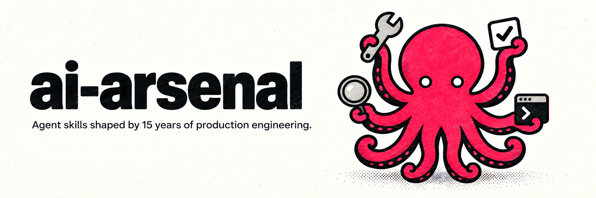

<p align="center">
  
</p>

# cc-arsenal

[](LICENSE)
[](https://agentskills.io)
[](https://github.com/astral-sh/ruff)

49 production-grade [Agent Skills](https://agentskills.io) for real development workflows: code review, shipping, docs, git, testing, multi-agent orchestration, and more. Each is a battle-tested workflow you invoke in plain language. Works with Claude Code, Codex, Cursor, Gemini CLI, and any Agent-Skills-compatible agent.

## See it work

```
You: ship it
```

`cc-arsenal` runs `review-code`, then your project's pre-merge checks, writes a conventional commit, opens the PR, watches CI, and merges on green.

## Quick Start

```bash
# Any Agent-Skills-compatible tool (Codex, Cursor, Gemini CLI, OpenCode, ...)
npx skills add mgiovani/cc-arsenal

# Claude Code: unlocks plugin variants, hooks, and subagent orchestration
/plugin marketplace add mgiovani/cc-arsenal
/plugin install cc-arsenal@cc-arsenal-marketplace
```

### Optional Features (Claude Code only)

```bash
make install-statusline           # Track usage and costs
make -C integrations/claude-code/claude-hi standard # Schedule 5-hour windows
```

## What's Included

<!-- gen:skills-readme start -->
<!-- generated: edit skills.sh.json or SKILL.md frontmatter, then run `make docs` -->

**49 Skills** organized by category:

<details>
<summary><b>AI Workflow Tools</b> (8): Tools that work on your AI agent itself, not on your codebase.</summary>

| Skill | What it does |
|---|---|
| [`agent-browser`](skills/agent-browser/) | AI-optimized browser automation with far less context overhead than raw Playwright/DOM tools |
| [`create-rule`](skills/create-rule/) | Create CLAUDE.md/AGENTS.md rules and memory guidelines |
| [`create-skill`](skills/create-skill/) | Specification-driven skill creation with eval system and description optimization |
| [`find-skills`](skills/find-skills/) | Discover and install third-party agent skills from skills.sh |
| [`improve-skill`](skills/improve-skill/) | Rewrite an existing skill to the authoring standard, with baseline-vs-new eval evidence |
| [`optimize-ai-setup`](skills/optimize-ai-setup/) | Measure token waste across installed AI coding tools and rank the fixes |
| [`render`](skills/render/) | Turn any output into an interactive HTML page you mark up in place, then read the marks back |
| [`wtf`](skills/wtf/) | Re-explain your own previous message in plain, simplified English (ASD-STE100 style) when the user didn't understand it |

</details>

<details>
<summary><b>Art & Images</b> (2): Mascots and logos, plus hero images and social cards for a project.</summary>

| Skill | What it does |
|---|---|
| [`codex-imagegen`](skills/codex-imagegen/) | Polished raster art (logos, mascots, heroes, sprites, mockups) via Codex CLI's $imagegen |
| [`project-illustrator`](skills/project-illustrator/) | A cohesive art system for a project: mascot, heroes, social cards and thumbnails with one character |

</details>

<details>
<summary><b>Build</b> (5): Feature work and bug fixes, plus refactors and test coverage for code you already have.</summary>

| Skill | What it does |
|---|---|
| [`clotho-research`](skills/clotho-research/) | Find what a change will actually touch before planning it: the code and prior art it meets, and the risks it carries |
| [`fix-bug`](skills/fix-bug/) | Test-driven debugging with strict sequential task chain and dependency enforcement |
| [`implement-feature`](skills/implement-feature/) | Feature implementation with senior staff engineer best practices and parallel subagent orchestration where available |
| [`refactor`](skills/refactor/) | Restructure existing code without changing behavior, verified against the full test suite at each step |
| [`test-suite`](skills/test-suite/) | Generate test suites by analyzing coverage gaps and writing tests that match project conventions |

</details>

<details>
<summary><b>Design</b> (3): Screens and flows, alongside design tokens and an accessibility-grade UX audit.</summary>

| Skill | What it does |
|---|---|
| [`product-design-spec`](skills/product-design-spec/) | Information architecture, user flows, screen inventory and per-screen states for an approved PRD |
| [`product-design-tokens`](skills/product-design-tokens/) | A durable W3C DTCG design-token contract, reusing your design system and enforcing WCAG 2.2 AA contrast |
| [`review-design`](skills/review-design/) | UX/UI/design quality audit mapped to WCAG 2.2 AA plus the Material Design 3 and Apple HIG guidelines |

</details>

<details>
<summary><b>Docs</b> (6): Architecture records and RFCs, plus diagrams and keeping docs honest about the code.</summary>

| Skill | What it does |
|---|---|
| [`docs-adr`](skills/docs-adr/) | Architecture Decision Records creation and management |
| [`docs-check`](skills/docs-check/) | Documentation validation and health scoring |
| [`docs-diagram`](skills/docs-diagram/) | Architecture diagrams generation (Mermaid) |
| [`docs-init`](skills/docs-init/) | Documentation structure initialization |
| [`docs-rfc`](skills/docs-rfc/) | Request for Comments documentation |
| [`docs-update`](skills/docs-update/) | Documentation sync with codebase state |

</details>

<details>
<summary><b>Git</b> (4): Branching and committing, plus merging and tagging versions in your own repository.</summary>

| Skill | What it does |
|---|---|
| [`git-commit`](skills/git-commit/) | Conventional commit message generation |
| [`git-release`](skills/git-release/) | Semantic version releases with automated changelog generation |
| [`git-sync`](skills/git-sync/) | Sync the current feature branch with its base/upstream via merge or rebase |
| [`gitflow`](skills/gitflow/) | Manage a gitflow branching workflow (feature/release/hotfix branches) |

</details>

<details>
<summary><b>GitHub</b> (3): Pull requests and merges, then taking a project public.</summary>

| Skill | What it does |
|---|---|
| [`git-create-pr`](skills/git-create-pr/) | Pull request creation with standardized formats |
| [`oss-launch`](skills/oss-launch/) | Take a private project public: secrets and license pre-flight, branding, README rewrite, then flip it |
| [`ship`](skills/ship/) | Orchestrates a branch from "code done" to "merged" (runs review-code plus project-specific pre-merge checks) |

</details>

<details>
<summary><b>Jira</b> (1): Jira from the command line.</summary>

| Skill | What it does |
|---|---|
| [`jira-cli`](skills/jira-cli/) | Interactive command-line tool for Atlassian Jira |

</details>

<details>
<summary><b>Multi-agent</b> (1): Fan a large task out across parallel agents.</summary>

| Skill | What it does |
|---|---|
| [`orchestrate`](skills/orchestrate/) | Decompose a task, map each part to the right model, run independent tracks in parallel, then synthesize |

</details>

<details>
<summary><b>Product</b> (3): Decide what to build and turn it into tracked, dependency-ordered work.</summary>

| Skill | What it does |
|---|---|
| [`prd-to-issues`](skills/prd-to-issues/) | Turn an approved PRD into tracked issues, one per requirement ID, with dependencies recorded |
| [`product-prd`](skills/product-prd/) | Right-sized PRD from an idea: brief, one-pager, PR/FAQ or full doc, with non-goals and testable requirements |
| [`project-planner`](skills/project-planner/) | Break down large projects into dependency-aware tasks with Mermaid visualization |

</details>

<details>
<summary><b>Project setup</b> (6): Containers and environment variables, database migrations and CI pipelines, as well as framework docs.</summary>

| Skill | What it does |
|---|---|
| [`ci-generate`](skills/ci-generate/) | Generate a production-ready CI/CD pipeline config (GitHub Actions, GitLab CI, CircleCI, Jenkins) |
| [`ci-local`](skills/ci-local/) | Run the checks a GitHub Actions workflow would run, locally, when Actions is unavailable |
| [`db-migrate`](skills/db-migrate/) | Create and validate database migrations, then manage them across any framework |
| [`docker-init`](skills/docker-init/) | Generate Dockerfiles and docker-compose.yml with auto-detected services and security hardening |
| [`env-setup`](skills/env-setup/) | Scan a codebase for env var usage, sync .env.example, and detect leaked secrets |
| [`inject-docs`](skills/inject-docs/) | Inject compressed framework-specific best practices and docs into CLAUDE.md/AGENTS.md |

</details>

<details>
<summary><b>Review</b> (7): Code and plans, security and dependencies, performance and visual regressions, and translations.</summary>

| Skill | What it does |
|---|---|
| [`i18n-check`](skills/i18n-check/) | i18n completeness checker, detects the project's i18n framework and diffs locale files |
| [`review-code`](skills/review-code/) | Multi-agent code review across six dimensions, from correctness and performance to tests and error handling |
| [`review-deps`](skills/review-deps/) | Audit dependencies for vulnerabilities, license risk, and staleness |
| [`review-perf`](skills/review-perf/) | Deep-dive performance audit of queries, algorithmic complexity, and resource leaks |
| [`review-plan`](skills/review-plan/) | Adversarially review an implementation plan against the actual repository before any code is written |
| [`review-security`](skills/review-security/) | OWASP Top 10 2025 security analysis with parallel scanning agents where available |
| [`vrt-check`](skills/vrt-check/) | Runs the project's visual regression testing workflow, whatever tooling the repo actually uses |

</details>
<!-- gen:skills-readme end -->

**Claude Code unlocks extras:**
- 9 plugin variants (install just the category you need, see `CLAUDE.md`)
- Per-skill hooks (e.g. auto-closing a browser session on stop)
- Parallel subagent orchestration for review/team skills
- Statusline (usage/cost tracking) and Claude Hi (5-hour window scheduling)

Every skill still works standalone in any Agent-Skills-compatible tool: the Claude Code layer is additive, never required.

## Documentation

- [Getting Started](docs/getting-started.md) - Installation and setup
- [Features](docs/features.md) - Complete skill reference
- [Statusline Guide](integrations/claude-code/statusline/STATUSLINE.md) - Usage tracking (Claude Code)
- [Claude Hi Guide](integrations/claude-code/claude-hi/README.md) - Session scheduling (Claude Code)
- [Troubleshooting](docs/troubleshooting.md) - Common issues
- [Changelog](CHANGELOG.md) - Version history
- [AGENTS.md](AGENTS.md) - Canonical, tool-agnostic skill guidance
- [CLAUDE.md](CLAUDE.md) - Claude-Code-specific additions

## Who builds this

Built and maintained by [Giovani Moutinho](https://giovani.dev), a senior engineer at a Bay Area big-tech company with 15+ years building scalable backend systems, now focused on AI tooling for developer productivity.
[GitHub](https://github.com/mgiovani) · [giovani.dev](https://giovani.dev)

## Contributing

Contributions welcome! See [CONTRIBUTING.md](CONTRIBUTING.md) for guidelines. New skills go under `skills/<name>/SKILL.md`, see `AGENTS.md` for the skill anatomy and portability convention.

## Support

- [Report bugs](https://github.com/mgiovani/cc-arsenal/issues)
- [Security vulnerabilities](docs/SECURITY.md)
- [Discussions](https://github.com/mgiovani/cc-arsenal/discussions)

## License

MIT License - see [LICENSE](LICENSE)
