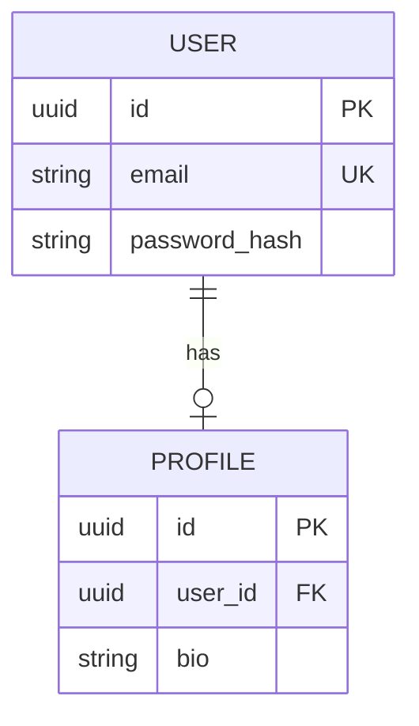
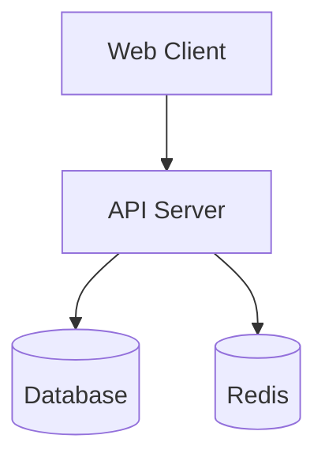
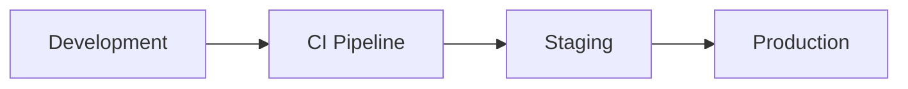
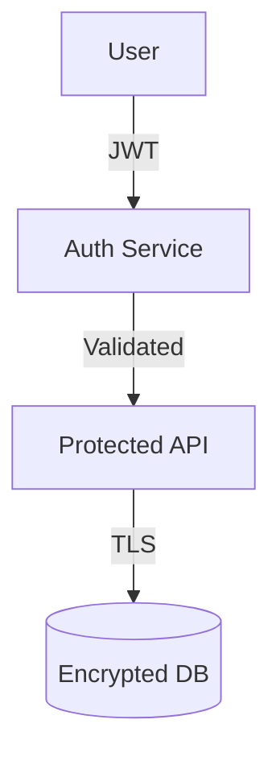

# Generate System Diagrams

Generate Mermaid diagrams including architecture, database schema, deployment, and security architecture.

## Anti-Hallucination Guidelines

**CRITICAL**: Diagrams must represent REAL components. Before adding ANY element:
1. **Verify component exists** - Read the actual file before adding it to diagram
2. **Confirm relationships** - Check imports/references to verify connections
3. **Count entities accurately** - Use find/glob to get exact counts
4. **No placeholder components** - Only include verified, existing elements
5. **Empty directories ≠ components** - Check directories have actual content

## Your Task

### Phase 1: Deep Analysis (Use Explore Agent)

**IMPORTANT**: Use the Explore agent to thoroughly analyze the codebase before generating diagrams:

```
Use Task tool with Explore agent:
- prompt: "For [DIAGRAM_TYPE] diagram, find all relevant components. For ER: find model/entity files and their relationships. For arch: find services, APIs, databases. For deployment: find Docker/K8s configs. Return ONLY verified files with their actual content structure."
- subagent_type: "Explore"
```

### Phase 2: Parse Arguments
   - Extract diagram type from `$ARGUMENTS`
   - Supported types: `er`, `arch`, `deployment`, `security`
   - Extract optional context (remaining arguments)

2. **Validate Diagram Type**:
   - If type not provided or invalid, show available types
   - Exit with helpful message

3. **Analyze Codebase** (based on diagram type):

   **For ER Diagrams (`er`)**:
   - Find ORM model files
   - Supported ORMs:
     - Python: SQLAlchemy, Django, Tortoise, SQLModel, Peewee
     - JS/TS: Prisma, TypeORM, Sequelize, Mongoose
     - Other: GORM (Go), ActiveRecord (Ruby)
   - Extract:
     - Tables/entities
     - Columns with types
     - Relationships (one-to-one, one-to-many, many-to-many)
     - Constraints (PK, FK, unique)

   **For Architecture Diagrams (`arch`)**:
   - Identify major components
   - Find services, APIs, workers
   - Detect queues, caches, databases
   - Map data flow between components
   - Identify external dependencies

   **For Deployment Diagrams (`deployment`)**:
   - Find deployment configs (docker-compose, k8s, etc.)
   - Identify services and their relationships
   - Map CI/CD pipeline
   - Document environment configurations

   **For Security Diagrams (`security`)**:
   - Find authentication/authorization code
   - Map security boundaries
   - Identify data encryption points
   - Document security controls

### Phase 3: Parallel Verification (Use SubAgents)

**Before generating, spawn parallel agents to verify different aspects**:

```
Example: Generating an architecture diagram

Agent 1 - Verify Services:
- prompt: "Find all actual service files/classes in the codebase. Return a list of verified service names with their file paths. Do NOT assume - only return what you can find."
- subagent_type: "Explore"

Agent 2 - Verify Databases:
- prompt: "Find all database configurations and connections. Look for DB URLs, ORM configs, connection pools. Return verified database technologies with evidence."
- subagent_type: "Explore"

Agent 3 - Verify External Integrations:
- prompt: "Find all external API calls, third-party service integrations. Look for HTTP clients, SDK imports, webhook handlers. Return verified external dependencies."
- subagent_type: "Explore"

Agent 4 - Verify Data Flow:
- prompt: "Trace how data flows between components. Look at imports, function calls, event handlers. Return verified connections between components."
- subagent_type: "Explore"

Merge results → Only include verified entities in diagram
```

**For ER diagrams specifically**:
```
Agent 1 - Find Models:
- prompt: "Find all ORM model/entity files. Extract table names and column definitions."
- subagent_type: "Explore"

Agent 2 - Find Relationships:
- prompt: "In the model files found, identify all foreign keys and relationship decorators. Map actual relationships."
- subagent_type: "Explore"

Only include entities and relationships that both agents confirm exist.
```

**Verification checklist before adding to diagram**:
```
For each entity/component you plan to include:
1. Read the actual source file to confirm it exists
2. For relationships, verify the import/reference exists in code
3. For counts (e.g., "5 services"), run: find . -name "*service*" | wc -l
4. Remove any component you cannot verify with actual code
```

4. **Generate Mermaid Diagram**:
   - Create appropriate Mermaid syntax based on type
   - **ONLY include verified components** - no assumptions
   - Include meaningful labels and relationships
   - Add comments for clarity
   - Keep diagram readable (not too complex)

5. **Load Template**:
   - Template location: `resources/templates/`
   - Select based on diagram type:
     - `er` → `data-model.md`
     - `arch` → `architecture.md`
     - `deployment` → `deployment.md`
     - `security` → `security.md`

6. **Populate Template**:
   Replace placeholders:
   - `{{PROJECT_NAME}}` - Git repo or directory name
   - `{{DATE}}` - Current date
   - `{{ER_DIAGRAM}}` or `{{DIAGRAM_CONTENT}}` - Generated Mermaid code
   - `{{ENTITIES}}` or `{{COMPONENTS}}` - Entity/component descriptions
   - Other diagram-specific placeholders

7. **Create or Update Documentation**:
   - Output to appropriate file in `docs/`
   - If file exists, ask before overwriting
   - Preserve custom content if possible

8. **Report Results**:
   - Show diagram type and output file
   - Display summary of what was detected
   - Provide next steps

## Supported Diagram Types

### ER Diagram (`er`)
**Output**: `docs/data-model.md`

Entity-Relationship diagram from database models.

**Detects**:
- Tables and entities
- Columns with data types
- Primary keys
- Foreign keys
- Relationships
- Constraints

**Mermaid syntax**:


### Architecture Diagram (`arch`)
**Output**: `docs/architecture.md`

System architecture and component relationships.

**Detects**:
- Services and modules
- API endpoints
- Databases
- Caches
- Message queues
- External services

**Mermaid syntax**:


### Deployment Diagram (`deployment`)
**Output**: `docs/deployment.md`

Deployment infrastructure and CI/CD.

**Detects**:
- Docker containers
- Kubernetes resources
- Cloud services
- CI/CD pipeline stages
- Environment configurations

**Mermaid syntax**:


### Security Diagram (`security`)
**Output**: `docs/security.md`

Security architecture and data flow.

**Detects**:
- Authentication flows
- Authorization boundaries
- Encryption points
- Security controls
- Trust boundaries

**Mermaid syntax**:


## Usage

Generate specific diagram type:
```
/docs:diagram er
/docs:diagram arch
/docs:diagram deployment
/docs:diagram security
```

With additional context:
```
/docs:diagram er for user and order tables
/docs:diagram arch for microservices architecture
/docs:diagram deployment with Docker and Kubernetes
```

Show available types:
```
/docs:diagram
```

## ORM Detection Examples

### Python ORMs
```bash
# SQLAlchemy
!`find . -name "*models.py" -exec grep -l "Base\|Column\|relationship" {} \; | head -10`

# Django
!`find . -name "models.py" -exec grep -l "models.Model" {} \; | head -10`

# Tortoise ORM
!`find . -name "*.py" -exec grep -l "tortoise.models" {} \; | head -10`
```

### JavaScript/TypeScript ORMs
```bash
# Prisma
!`find . -name "schema.prisma"`

# TypeORM
!`find . -name "*.entity.ts" -o -name "*entity.js" | head -10`

# Sequelize
!`find . -name "*.model.js" -o -name "*.model.ts" | head -10`
```

## Architecture Detection Examples

```bash
# Find services
!`find . -name "*service*.ts" -o -name "*service*.py" -o -name "*service*.js" | head -15`

# Find API routes
!`find . -name "*router*.ts" -o -name "*routes*.py" -o -name "*controller*.js" | head -15`

# Find configs
!`find . -name "*.config.js" -o -name "*.config.ts" -o -name "config.py" | head -10`
```

## Deployment Detection Examples

```bash
# Docker
!`find . -name "Dockerfile" -o -name "docker-compose.yml" -o -name "docker-compose.yaml"`

# Kubernetes
!`find . -name "*.k8s.yaml" -o -name "*.k8s.yml" -o -name "*deployment.yaml"`

# CI/CD
!`find . -name ".github/workflows/*.yml" -o -name ".gitlab-ci.yml" -o -name "Jenkinsfile"`
```

## Important Notes

- **Auto-detection**: Diagrams generated from actual code
- **Mermaid format**: Uses GitHub-compatible Mermaid syntax
- **Readable diagrams**: Limits complexity for clarity
- **Incremental**: Can regenerate as code evolves
- **Template-based**: Uses templates for consistent formatting
- **Context-aware**: Uses optional context to guide generation

## Example Output

```
ER Diagram Generated ✓

Detected: 5 entities, 12 relationships
File: docs/data-model.md

Entities Found:
  ✓ User (SQLAlchemy model)
  ✓ Profile (SQLAlchemy model)
  ✓ Role (SQLAlchemy model)
  ✓ Permission (SQLAlchemy model)
  ✓ UserRole (junction table)

Relationships:
  ✓ User → Profile (one-to-one)
  ✓ User → UserRole (one-to-many)
  ✓ Role → UserRole (one-to-many)
  ✓ Role → Permission (many-to-many)

Next Steps:
  1. Review generated ER diagram
  2. Add entity descriptions if needed
  3. Update when schema changes
  4. Reference in architecture docs
```

## When to Run

Run when:
- Database schema has been modified (`er`)
- Architecture has evolved (`arch`)
- Deployment configuration changed (`deployment`)
- Security architecture modified (`security`)
- Onboarding new team members (all diagrams)
- Documentation review (all diagrams)

## Best Practices

- **Keep current**: Regenerate after significant changes
- **Review generated**: Always review auto-generated content
- **Add context**: Supplement with manual descriptions
- **Link diagrams**: Reference diagrams in related docs
- **Version control**: Commit diagram updates with code changes
- **Simplify**: Break complex diagrams into multiple views

---

**Template Location**: `resources/templates/`
**Output Directory**: `docs/`
