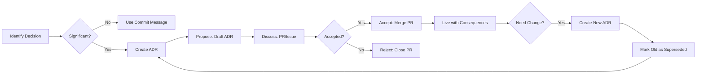

# 0001 - Record Architecture Decisions

| Field | Value |
| --- | --- |
| Status | Accepted |
| Date | 2025-10-27 |

## Context

As Claude Code Arsenal grows and evolves, we need to track the architectural decisions that shape the project. Team members (both current and future contributors) need to understand:

- Why certain design choices were made
- What alternatives were considered
- The context and constraints at the time of each decision
- The consequences (both positive and negative) of each decision

Without documentation, important architectural knowledge exists only in commit messages, pull request discussions, or maintainers' memories. This creates several problems:

1. Knowledge loss: when contributors leave, their reasoning disappears
2. Repeated discussions: teams revisit the same debates without historical context
3. Inconsistent decisions: new features may contradict earlier architectural choices
4. Onboarding friction: new contributors struggle to understand why things work a certain way

We need a lightweight, sustainable process for documenting architectural decisions that:
- Is easy to create and maintain
- Lives close to the code (in the repository)
- Provides historical context
- Is discoverable and searchable
- Doesn't require special tools to read

## Decision

We will use Architecture Decision Records (ADRs) as described by Michael Nygard to document significant architectural decisions in this project.

### What we will do

1. Create ADRs for significant decisions: document architectural decisions that have lasting impact on the system
2. Store in repository: keep ADRs in `docs/adr/` directory as markdown files
3. Number sequentially: name files as `NNNN-title-with-dashes.md` (e.g., `0002-use-symlink-architecture.md`)
4. Use simple format: follow Nygard's lightweight template.
   - Title: short, descriptive name
   - Status: Proposed, Accepted, Deprecated, Superseded
   - Context: forces and constraints
   - Decision: what we decided to do
   - Consequences: results, good and bad
5. Make ADRs immutable: once accepted, ADRs are not modified (except to mark as deprecated/superseded)
6. Link related ADRs: reference previous ADRs when superseding or building on them
7. Use the `/docs:adr` command: leverage the built-in command for creating new ADRs

### What Qualifies as an ADR

Document decisions that:
- Affect structure: component organization, module boundaries, data flow
- Have lasting impact: changes that are hard to reverse later
- Involve trade-offs: decisions where alternatives were seriously considered
- Set precedent: choices that guide future decisions

Examples of ADR-worthy decisions:
- Choosing symlink-based installation vs. file copying
- Plugin system architecture
- Component categories (agents, commands, skills)
- Testing strategy and coverage requirements
- Python version requirements

Not ADR-worthy (use commit messages instead):
- Bug fixes
- Minor refactorings
- Dependency updates
- Code style choices (use style guide)
- Implementation details within established patterns

### ADR Workflow



### Template Structure

```markdown
# NNNN - Title

**Status:** Proposed | Accepted | Deprecated | Superseded by [ADR-NNNN](NNNN-title.md)

**Date:** YYYY-MM-DD

## Context

What is the issue that we're seeing that is motivating this decision or change?

## Decision

What is the change that we're proposing and/or doing?

## Consequences

What becomes easier or more difficult to do because of this change?
```

### Creating ADRs

Use the `/docs:adr` command:
```bash
# In Claude Code
/docs:adr "Use symlink architecture for installation"

# Or manually create numbered file
docs/adr/0002-use-symlink-architecture.md
```

## Consequences

### Positive

- Historical record: future contributors understand why decisions were made
- Better decisions: considering consequences upfront leads to more thoughtful choices
- Reduced debate: historical context prevents rehashing the same discussions
- Onboarding aid: new contributors learn architectural principles quickly
- Searchable: Git and text search make finding decisions easy
- Low overhead: simple markdown format, no special tools required
- Version controlled: ADRs evolve with the codebase
- Immutable history: accepted ADRs provide stable reference points

### Negative

- Process overhead: contributors must remember to create ADRs for significant decisions
- Writing effort: takes time to document decisions clearly
- Judgment calls: not always obvious what qualifies as "significant"
- Maintenance: need to keep ADR index up to date (or use tooling)
- Potential for overuse: risk of creating ADRs for trivial decisions
- Consensus required: team must agree on what warrants an ADR

### Mitigation

To address the negative consequences:
- Provide clear guidelines for what qualifies as an ADR
- Make ADR creation easy with the `/docs:adr` command
- Include ADR check in PR review process (but don't block)
- Keep templates simple and lightweight
- Lead by example: Maintainers create ADRs for their own decisions

## References

- [Documenting Architecture Decisions](https://cognitect.com/blog/2011/11/15/documenting-architecture-decisions) by Michael Nygard
- [ADR Tools](https://github.com/npryce/adr-tools) by Nat Pryce
- [Architecture Decision Records](https://adr.github.io/) - ADR GitHub Organization

## Related Decisions

None (this is the first ADR).

## Changelog

- 2025-10-27: Initial ADR created as part of documentation initialization
