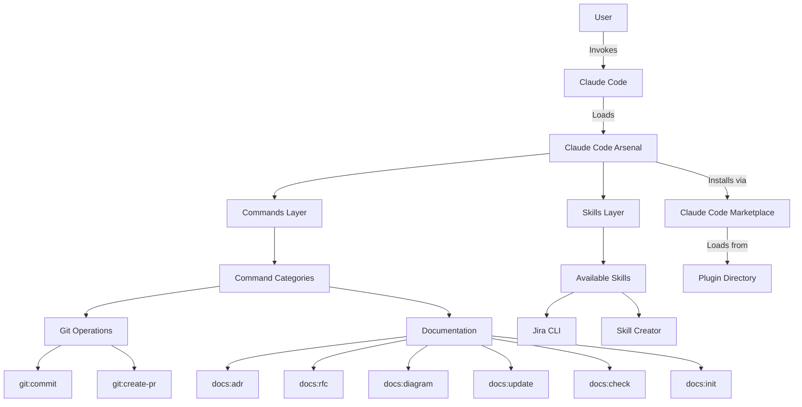

# Claude Code Arsenal Architecture

**Last Updated:** 2026-02-13
**Version:** 3.1.0
**Authors:** Giovani Moutinho

## Overview

Claude Code Arsenal is a professional collection of workflow automation skills designed to enhance Claude Code's capabilities. The system uses a **dual-repository architecture** that separates cross-platform base skills from Claude Code-specific enhancements, enabling skill distribution across multiple AI agent platforms while maintaining optimized Claude Code features.

## Dual-Repository Architecture

cc-arsenal uses two repositories that work together:

```
┌─────────────────────────────────────────────────────────────┐
│                      cc-arsenal (this repo)                  │
│  ┌────────────────────┐         ┌─────────────────────────┐ │
│  │ Enhanced Skills    │         │ Optional Features       │ │
│  │ (Claude Code)      │         │ - Statusline            │ │
│  │ - Subagents        │         │ - Claude Hi Scheduler   │ │
│  │ - Task tool        │         │                         │ │
│  │ - Advanced context │         │                         │ │
│  └────────────────────┘         └─────────────────────────┘ │
│           ↕ sync                                             │
│  ┌────────────────────┐                                      │
│  │ skills-upstream/   │ (git submodule)                      │
│  │ mgiovani/skills    │                                      │
│  └────────────────────┘                                      │
└─────────────────────────────────────────────────────────────┘
                         ↓
        ┌────────────────────────────────────┐
        │    mgiovani/skills (separate repo) │
        │  ┌──────────────────────────────┐  │
        │  │ Base Skills                  │  │
        │  │ (Cross-Platform)             │  │
        │  │ - Cursor, Windsurf, etc.     │  │
        │  │ - No platform-specific deps  │  │
        │  │ - Published to skills.sh     │  │
        │  └──────────────────────────────┘  │
        └────────────────────────────────────┘
```

### Components

**Base Skills** ([mgiovani/skills](https://github.com/mgiovani/skills)):
- Cross-platform SKILL.md format
- Works with Claude Code, Cursor, Windsurf, and 30+ AI agents
- No platform-specific features (no Task tool, hooks, or Claude Code frontmatter)
- Published to [skills.sh](https://skills.sh) marketplace
- 22 core skills for development, documentation, git, and Jira workflows

**Enhanced Skills** (cc-arsenal):
- Claude Code-specific optimizations
- Uses subagents (Task tool) for parallel work
- Advanced context management and hooks
- Quality gates with pre/post hooks
- Builds on base skills with additional capabilities
- 10 Claude Code-exclusive skills + 22 enhanced base skills = 32 total

**Sync Workflow**:
- Base skills maintained in `skills-upstream/` submodule
- Enhancement layer in `enhancements/` adds Claude Code features
- `make sync-skills` command merges base + enhancements into `skills/`
- SYNC.md files track synchronization status

## System Context

Claude Code Arsenal operates as an extension layer on top of Claude Code, providing:
- **Workflow Commands**: Git operations and documentation generation (ADR, RFC, diagrams)
- **Skills**: Model-invoked capabilities that Claude automatically loads when relevant (Jira CLI, skill creator)

The system integrates with:
- **Claude Code CLI**: The primary execution environment
- **Git**: For version control operations and conventional commits
- **GitHub**: For pull request creation and repository management
- **Jira**: For issue tracking integration (via jira-cli skill)

## Goals and Non-Goals

### Goals

- **Developer Experience**: Provide seamless, zero-config installation via Claude Code marketplace
- **Documentation Automation**: Generate and maintain architecture documentation, ADRs, RFCs, and diagrams
- **Git Workflow Automation**: Streamline commit and PR creation with conventional commit standards
- **Quality**: Enforce coding standards and best practices

### Non-Goals

- **IDE Integration**: This is a CLI tool, not an IDE plugin
- **Language-Specific Tools**: Focuses on workflow automation, not language-specific tooling
- **Code Execution**: Commands coordinate work; they don't execute untrusted code
- **Cloud Services**: Runs entirely locally; no cloud dependencies

## High-Level Design



The system uses a **plugin-based architecture** with clear separation between:
1. **Installation Layer**: Claude Code marketplace plugin system
2. **Component Layer**: Commands, skills
3. **Execution Layer**: Claude Code runtime
4. **Integration Layer**: External tools (Git, GitHub, Jira, etc.)

### Detailed Component Architecture

```mermaid
graph TB
    subgraph "User Interface"
        User[Developer/User]
    end

    subgraph "Claude Code Runtime"
        Claude[Claude Code CLI]
        EventSystem[Event System]
    end

    subgraph "cc-arsenal Plugin"
        PluginDesc[plugin.json<br/>Descriptor]

        subgraph "Commands Layer"
            GitCommands["Git Commands (2)"]
            GitCommit["git:commit"]
            GitPR["git:create-pr"]

            DocsCommands["Docs Commands (6)"]
            DocsADR["docs:adr"]
            DocsRFC["docs:rfc"]
            DocsDiagram["docs:diagram"]
            DocsUpdate["docs:update"]
            DocsCheck["docs:check"]
            DocsInit["docs:init"]
        end

        subgraph "Skills Layer"
            JiraSkill[jira-cli/<br/>Jira Integration]
            CreatorSkill[create-skill/<br/>Skill Creation]
        end

        subgraph "Templates"
            ADRTemplates[ADR Templates<br/>full/lightweight/nygard]
            RFCTemplates[RFC Templates<br/>detailed/minimal/standard]
            DocTemplates[Doc Templates<br/>architecture/contributing/etc]
        end

        subgraph "Scripts Layer"
            Setup[setup/<br/>install.py]
            Utils[claude/<br/>utilities]
        end
    end

    subgraph "External Systems"
        GitCLI[Git CLI]
        GitHubCLI[GitHub CLI 'gh']
        JiraAPI[Jira REST API]
        FileSystem[Local Filesystem<br/>~/.claude/]
    end

    %% User interactions
    User -->|"/git:commit"| Claude
    User -->|"/docs:adr"| Claude
    User -->|Edit files| Claude

    %% Claude Code interactions
    Claude -->|Loads plugin| PluginDesc
    Claude -->|Invokes commands| GitCommands
    Claude -->|Invokes commands| DocsCommands
    Claude -->|Triggers events| EventSystem
    Claude -->|Loads skills| JiraSkill
    Claude -->|Loads skills| CreatorSkill

    %% Command details
    GitCommands --> GitCommit
    GitCommands --> GitPR
    DocsCommands --> DocsADR
    DocsCommands --> DocsRFC
    DocsCommands --> DocsDiagram
    DocsCommands --> DocsUpdate
    DocsCommands --> DocsCheck
    DocsCommands --> DocsInit

    %% Template usage
    DocsADR --> ADRTemplates
    DocsRFC --> RFCTemplates
    DocsInit --> DocTemplates
    DocsDiagram --> DocTemplates

    %% External integrations
    GitCommit -->|"git commit"| GitCLI
    GitPR -->|"gh pr create"| GitHubCLI
    JiraSkill -->|REST API| JiraAPI
    Setup -->|"create symlinks"| FileSystem

    %% Styling
    classDef commandStyle fill:#e1f5ff,stroke:#0288d1,stroke-width:2px
    classDef skillStyle fill:#f3e5f5,stroke:#7b1fa2,stroke-width:2px
    classDef externalStyle fill:#e8f5e9,stroke:#388e3c,stroke-width:2px
    classDef templateStyle fill:#fce4ec,stroke:#c2185b,stroke-width:2px

    class GitCommands,DocsCommands,GitCommit,GitPR,DocsADR,DocsRFC,DocsDiagram,DocsUpdate,DocsCheck,DocsInit commandStyle
    class JiraSkill,CreatorSkill skillStyle
    class GitCLI,GitHubCLI,JiraAPI,FileSystem externalStyle
    class ADRTemplates,RFCTemplates,DocTemplates templateStyle
```



**Component Count:**
- **8 Commands**: 2 Git + 6 Documentation
- **2 Skills**: Jira CLI + Skill Creator
- **12 Templates**: 3 ADR + 3 RFC + 6 Documentation

## Detailed Design

### Core Components

#### Installation System

**Responsibilities:**
- Plugin marketplace integration for one-click installation
- Plugin descriptor management and versioning
- Component registration with Claude Code
- Configuration management and validation

**Interfaces:**
- **Plugin Descriptor**: `plugin.json` - Declares commands and skills
- **Marketplace Integration**: Distributed via Claude Code marketplace
- **Makefile**: Development and validation commands

**Dependencies:**
- Claude Code CLI (host environment)
- Git (for repository management)
- Python 3.12+ with UV (for development only)

#### Commands System

**Responsibilities:**
- Provide slash commands for explicit user-invoked operations
- Automate Git workflows with conventional commits
- Generate documentation (ADRs, RFCs, diagrams)
- Manage testing and quality assurance workflows

**Interfaces:**
- **COMMAND.md Format**: Markdown files with command definitions
- **Slash Command Syntax**: `/command-name [args]`
- **Template System**: Jinja2 templates for generated content

**Dependencies:**
- Claude Code SlashCommand tool
- Git CLI for version control operations
- GitHub CLI (gh) for pull request creation

**Available Commands:**
- `git/` - **2 commands**: `commit`, `create-pr`
- `docs/` - **6 commands**: `adr`, `rfc`, `diagram`, `update`, `check`, `init`

**Note:** Empty `testing/` and `utility/` directories exist for future expansion.

#### Skills System

**Responsibilities:**
- Provide model-invoked capabilities that Claude loads automatically
- Use progressive disclosure to save context
- Bundle scripts, references, and assets for complex tasks
- Enable skill creation and distribution

**Interfaces:**
- **SKILL.md Format**: Markdown with YAML frontmatter (name, description)
- **Auto-Invocation**: Claude discovers skills via frontmatter metadata
- **Resource Bundling**: scripts/, references/, assets/ directories

**Dependencies:**
- Claude Code Skill tool
- External tools (Jira CLI for jira-cli skill)
- Python scripts for skill utilities

**Available Skills:**
- `create-skill/` - Specification-driven skill creation with live documentation fetching
- `jira-cli/` - Interactive Jira command-line tool

### Data Flow

#### Command Execution Flow

1. User types slash command (e.g., `/git:commit`)
2. Claude Code detects slash command
3. COMMAND.md file is loaded and expanded
4. Claude executes command logic
5. Results are presented to user

#### Skill Activation Flow

1. User request matches skill description/context
2. Claude automatically loads SKILL.md frontmatter (metadata)
3. If skill is relevant, Claude loads SKILL.md body
4. Claude loads bundled resources only as needed
5. Skill guides Claude through specialized workflow

### APIs and Interfaces

#### Internal APIs

- **Plugin Descriptor API**: JSON-based plugin configuration
  ```json
  {
    "name": "cc-arsenal",
    "version": "1.0.0",
    "commands": ["./commands/git/commit.md"],
    "skills": ["./skills/jira-cli/"]
  }
  ```

- **Command Template API**: Markdown files with YAML frontmatter
  ```markdown
  ---
  name: my-command
  description: Command description
  ---
  # Command implementation
  ```

#### External Integrations

- **Claude Code Plugin API**: `plugin.json` descriptor format
- **Git CLI**: Shell command execution for version control
- **GitHub CLI (gh)**: API calls for pull requests and issues
- **Jira REST API**: Integration via jira-cli skill

## Technology Stack

### Backend

- **Language:** Python 3.12+
- **Package Manager:** UV (modern, fast Python package manager)
- **CLI Framework:** Click + Typer for command-line interfaces
- **Validation:** Pydantic 2.x for data validation and settings
- **Templating:** Jinja2 for content generation

### Development Tools

- **Linting:** Ruff (fast Python linter)
- **Type Checking:** Mypy with strict mode
- **Testing:** pytest with >90% coverage requirement
- **Formatting:** Ruff formatter with single quotes
- **Pre-commit:** Automated quality checks

### Infrastructure

- **Installation:** Symlink-based architecture
- **Distribution:** Git repository + Claude Code marketplace
- **Configuration:** JSON files in ~/.claude/
- **Storage:** Local file system only

## Security Considerations

### Authentication & Authorization

- **No Authentication Required**: Runs locally with user's file system permissions
- **Permission Model**: Relies on OS-level file permissions

### Data Protection

- **No Data Collection**: All operations are local; no telemetry
- **Secure Defaults**: Git operations use user's existing Git configuration

### Network Security

- **External Calls**: Only to user-authorized services (GitHub, Jira)
- **API Token Management**: Uses user's existing token storage
- **No Cloud Dependencies**: Entirely local execution

## Performance and Scalability

### Performance Requirements

- **Component Load Time**: <100ms to load command/skill files
- **Command Execution**: <1s for local commands, variable for Git/API operations

### Scaling Strategy

- **Horizontal Scaling**: Not applicable (local CLI tool)
- **Vertical Scaling**: Limited by local machine resources
- **Component Loading**: Lazy loading via Claude Code's progressive disclosure

### Bottlenecks and Limitations

- **File System I/O**: Command/skill loading depends on disk speed
- **External APIs**: GitHub/Jira operations limited by API rate limits
- **Context Window**: Skills with large bundled resources may consume significant context

## Reliability and Monitoring

### Error Handling

- **User Feedback**: Rich CLI output with clear error messages
- **Logging**: Structured logging for debugging

### Monitoring and Observability

- **Metrics**: None (local tool with no telemetry)
- **Logging**: Optional debug logging to ~/.claude/logs/
- **Tracing**: Not applicable
- **Alerting**: User-visible error messages only

### Disaster Recovery

- **Backup**: User's Git repository serves as backup
- **Recovery**: Reinstall from marketplace or Git clone
- **Rollback**: Git version control for configuration changes

## Deployment and Operations

### Deployment Strategy

**Plugin Installation (Recommended):**

```bash
/plugin marketplace add mgiovani/cc-arsenal
```
```bash
/plugin install cc-arsenal@cc-arsenal-marketplace
```

**Alternative: Direct Installation:**
```bash
# Clone and install locally
git clone https://github.com/mgiovani/cc-arsenal.git
cd cc-arsenal

# Install dependencies
uv sync

# Install via symlinks (changes reflect immediately)
make install

# For development: install dev dependencies and validate
uv sync --extra dev
make validate-plugins
```

### Configuration Management

- **Plugin Descriptor**: `.claude-plugin/plugin.json` in repository
- **Documentation Templates**: `resources/templates/` for doc generation
- **Command Definitions**: Individual `.md` files in `commands/` directories

### Development Workflow

1. **Clone Repository**: Fork and clone cc-arsenal
2. **Install Dependencies**: `uv sync --extra dev`
3. **Make Changes**: Edit commands or skills
4. **Validate Plugin**: `make validate-plugins` checks structure
5. **Run Quality Checks**: `make check` (lint, format, type-check, test)
6. **Test in Claude Code**: Install plugin locally and test
7. **Submit PR**: Follow conventional commit format

## Alternative Designs Considered

### Alternative 1: Monolithic Plugin

**Description:** Single large plugin file instead of modular components

**Pros:**
- Simpler distribution
- Fewer files to manage
- Single version number

**Cons:**
- Users must install everything or nothing
- Harder to customize and extend
- Larger context window usage
- Slower loading times

**Decision:** Rejected in favor of modular architecture for flexibility and extensibility

### Alternative 2: Cloud-Based Service

**Description:** Host commands and skills in cloud with API access

**Pros:**
- Centralized updates
- Version control for all users
- Analytics and usage tracking

**Cons:**
- Privacy concerns (data leaves user's machine)
- Network dependency
- Latency for API calls
- Requires authentication infrastructure

**Decision:** Rejected to maintain local-first, privacy-focused approach

### Alternative 3: VS Code Extension

**Description:** Build as VS Code extension instead of Claude Code plugin

**Pros:**
- Larger user base
- Rich IDE integration
- More mature extension ecosystem

**Cons:**
- Doesn't integrate with Claude Code workflow
- Requires different architecture
- Limited to VS Code users

**Decision:** Rejected; cc-arsenal is specifically designed for Claude Code

## Future Considerations

### Planned Improvements

- **Extended Command Library**: More testing and utility commands
- **Template Library**: More documentation templates (API docs, testing guides)
- **Integration Testing**: E2E tests for command workflows
- **Documentation Site**: Dedicated docs site with examples and tutorials

### Technical Debt

- **Test Coverage**: Need to increase from current coverage to >90%
- **Type Hints**: Some scripts lack complete type annotations
- **Command Documentation**: Some commands need more detailed usage examples
- **Error Handling**: Commands could provide more actionable error messages

### Long-term Vision

**6-Month Goals:**
- 20+ commands covering testing, deployment, and code analysis workflows
- Community-contributed skill library for common integrations
- Automated command testing framework with E2E scenarios
- Comprehensive documentation with video tutorials

**12-Month Goals:**
- Multi-project documentation management
- Advanced workflow orchestration with command dependencies
- Integration with more external tools (Linear, Notion, Slack, etc.)
- Command performance analytics and optimization
- AI-assisted documentation generation improvements

## References and Resources

- [Claude Code Documentation](https://docs.claude.com/en/docs/claude-code)
- [Plugin System Documentation](https://docs.claude.com/en/docs/claude-code/plugins)
- [Contributing Guidelines](./contributing.md)
- [Onboarding Guide](./onboarding.md)
- [ADR Directory](./adr/)

## Glossary

- **Plugin**: Claude Code extension installed via marketplace, containing commands and skills
- **Command**: User-invoked slash command for explicit workflow automation (e.g., `/git:commit`)
- **Skill**: Model-invoked capability that Claude automatically loads when context matches
- **Plugin Descriptor**: `plugin.json` file declaring plugin components and metadata
- **Progressive Disclosure**: Loading only necessary information to save context window
- **Conventional Commits**: Standardized commit message format (type(scope): description)

---

*This document follows Google's documentation standards for architecture documentation.*
