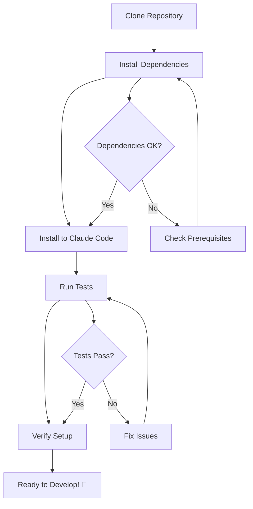

# Claude Code Arsenal - Developer Onboarding Guide

**Last Updated:** 2025-12-12

## Welcome to Claude Code Arsenal! 🎉

This guide will help you get started as a developer on the Claude Code Arsenal project. Whether you're contributing new commands or skills, this guide will walk you through everything you need to know.

## Prerequisites

### Required Tools

- **Python 3.12+**: Download from [python.org](https://www.python.org/downloads/)
- **UV Package Manager**: Modern, fast Python package installer
  ```bash
  curl -LsSf https://astral.sh/uv/install.sh | sh
  ```
- **Git**: For version control
- **Claude Code**: The host environment for this project

### Recommended Tools

- **VS Code** or **Cursor**: Modern code editors with Python support
- **GitHub CLI (gh)**: For PR creation and issue management
  ```bash
  brew install gh  # macOS
  ```

### Account Requirements

- GitHub account with repository access
- (Optional) Jira account if working on jira-cli skill

## Quick Start

### Setup Flow



### 1. Repository Setup

```bash
# Fork the repository on GitHub first, then:
git clone https://github.com/YOUR-USERNAME/cc-arsenal.git
cd cc-arsenal

# Add upstream remote
git remote add upstream https://github.com/mgiovani/cc-arsenal.git

# Install Python dependencies
uv sync --extra dev
```

### 2. Install to Claude Code

```bash
# Install Arsenal components to ~/.claude
make install

# Or run the installation script directly
uv run python -m scripts.setup.install

# Verify installation
ls -la ~/.claude/commands/
ls -la ~/.claude/skills/
```

### 3. Verification

```bash
# Run tests to verify setup
make test

# Run all quality checks
make check

# Test a specific component
uv run pytest tests/test_agent_generator.py -v
```

## Development Workflow

### Workflow Diagram

```mermaid
gitgraph
    commit id: "Initial"
    branch develop
    checkout develop
    commit id: "Setup"

    branch feature/new-command
    checkout feature/new-command
    commit id: "Create command"
    commit id: "Add tests"
    commit id: "Update docs"

    checkout develop
    merge feature/new-command
    commit id: "Command merged"

    checkout main
    merge develop
    commit id: "Release v0.2.0"
```

### Branch Management

- `main` - Production-ready, stable releases
- `develop` - Integration branch for features
- `feature/*` - New features (commands, skills)
- `fix/*` - Bug fixes
- `docs/*` - Documentation improvements

### Code Standards

- **Type Hints**: Required for all Python functions
- **Docstrings**: Google-style docstrings for public APIs
- **Formatting**: Ruff with single quotes, 90 character line length
- **Testing**: >90% code coverage requirement
- **Linting**: Pass all Ruff checks before committing

### Commit Guidelines

Follow [Conventional Commits](https://www.conventionalcommits.org/):

```bash
# Examples
git commit -m "feat(commands): add new documentation command"
git commit -m "docs(onboarding): add development workflow section"
git commit -m "test(commands): add tests for git:commit command"
git commit -m "chore(deps): update pydantic to 2.5.1"
```

**Commit Types:**
- `feat:` - New feature (command, skill)
- `fix:` - Bug fix
- `docs:` - Documentation only
- `style:` - Code style changes (formatting)
- `refactor:` - Code refactoring (no functional changes)
- `test:` - Adding or updating tests
- `chore:` - Maintenance tasks (dependencies, config)

## Project Structure

```
cc-arsenal/
├── .claude-plugin/     # Plugin configuration
│   └── plugin.json        # Plugin descriptor
├── commands/           # Workflow automation
│   ├── docs/              # Documentation generation
│   └── git/               # Git operations
├── skills/            # Model-invoked capabilities
│   ├── skill-creator/     # Guide for creating skills
│   └── jira-cli/          # Jira CLI integration
├── scripts/           # Installation and utilities
│   ├── setup/             # install.py, configure.py
│   ├── generators/        # agent_generator.py
│   ├── claude/            # Claude Code utilities
│   └── claude-hi/         # Session management
├── tests/             # Test files
├── docs/              # Documentation
├── .claude/           # Claude Code configuration
├── pyproject.toml     # Python project configuration
├── Makefile           # Development commands
└── README.md          # Project overview
```

### Key Directories

- `.claude-plugin/` - Plugin configuration and descriptor
- `commands/` - Slash command files (.md format)
  - `resources/templates/` - Documentation generation templates (ADR, RFC, docs)
- `skills/` - Model-invoked skills with bundled resources
- `scripts/` - Python utilities for setup and generators
- `tests/` - pytest test files
- `docs/` - Project documentation and guides

## Development Environment

### Local Development

**Install in Development Mode:**
```bash
# Install with symlinks (changes reflect immediately)
make install

# Or use dry-run to see what would be installed
make dry-run
```

**Validate Plugin Structure:**
```bash
# Validate plugin.json and component structure
make validate-plugins

# Check for errors in command/hook/skill definitions
```

### Testing

```bash
# Run all tests
make test

# Run tests with coverage report
make coverage

# Run specific test file
uv run pytest tests/test_agent_generator.py -v

# Run tests matching pattern
uv run pytest -k "test_agent" -v

# Run tests and open coverage report
make coverage
open htmlcov/index.html
```

### Code Quality

```bash
# Run all quality checks
make check

# Individual checks
make lint          # Ruff linting
make format        # Code formatting
make type-check    # Mypy type checking

# Auto-fix issues
make format        # Formats code in place
```

### Debugging

**Debug Installation:**
```bash
# Dry run shows what would be installed
make dry-run

# Check symlinks
ls -la ~/.claude/commands/
ls -la ~/.claude/skills/

# Verify command is loadable
cat ~/.claude/commands/git/commit.md
```

**Debug Tests:**
```bash
# Run with verbose output
uv run pytest -vv

# Run with print statements
uv run pytest -s

# Run with debugger on failure
uv run pytest --pdb
```

## Architecture Overview

Claude Code Arsenal uses a **plugin-based architecture** for modular component loading. Components can be installed via the Claude Code marketplace or directly via `make install`.

**Installation Flow:**
1. User installs via Claude Code marketplace (recommended) or `make install` (alternative)
2. Plugin descriptor (`plugin.json`) declares available components
3. Claude Code discovers commands and skills from plugin
4. Components are loaded on-demand when needed

**Component Types:**
- **Commands**: Slash commands for user-invoked operations (e.g., `/git:commit`)
- **Skills**: Auto-loaded by Claude when context matches (e.g., Jira CLI)

See [architecture.md](./architecture.md) for detailed system design.

## Common Tasks

### Adding a New Command

1. **Create Command File**:
   ```bash
   # Create in appropriate category
   vim commands/utility/my-command.md
   ```

2. **Define Command**:
   ```markdown
   ---
   name: my-command
   description: Brief command description
   ---

   # Command implementation here
   ```

3. **Install and Test**:
   ```bash
   make install
   # Test in Claude Code: /my-command
   ```

### Adding a New Skill

1. **Create Skill Directory**:
   ```bash
   mkdir -p skills/my-skill
   ```

2. **Create SKILL.md**:
   ```bash
   vim skills/my-skill/SKILL.md
   ```

3. **Add Bundled Resources** (optional):
   ```bash
   mkdir -p skills/my-skill/scripts
   mkdir -p skills/my-skill/references
   ```

4. **Install and Test**:
   ```bash
   make install
   # Claude will auto-load when context matches
   ```

See `skills/skill-creator/SKILL.md` for comprehensive skill creation guide.

### Fixing a Bug

1. **Create Fix Branch**:
   ```bash
   git checkout -b fix/bug-description
   ```

2. **Write Failing Test** (TDD approach):
   ```bash
   vim tests/test_bugfix.py
   uv run pytest tests/test_bugfix.py  # Should fail
   ```

3. **Fix the Issue**:
   ```bash
   # Make your changes
   uv run pytest tests/test_bugfix.py  # Should pass
   ```

4. **Run Full Test Suite**:
   ```bash
   make test
   make check
   ```

5. **Submit PR**: Follow PR process

## Troubleshooting

### Common Issues

#### Issue: "uv: command not found"

**Solution:**
```bash
# Install UV package manager
curl -LsSf https://astral.sh/uv/install.sh | sh

# Restart your shell or source profile
source ~/.bashrc  # or ~/.zshrc
```

#### Issue: "make: command not found"

**Solution:**
```bash
# Use the direct script commands instead
uv run python -m scripts.setup.install
uv run pytest
```

#### Issue: Command not showing up in Claude Code

**Solution:**
```bash
# Verify symlink was created
ls -la ~/.claude/commands/

# Reinstall
make install

# Check for errors in installation output
```

#### Issue: Tests failing with import errors

**Solution:**
```bash
# Ensure you're in the correct directory
cd cc-arsenal

# Reinstall dependencies
uv sync --extra dev

# Verify Python version
python --version  # Should be 3.12+
```

#### Issue: Type checking errors

**Solution:**
```bash
# Run type checker
make type-check

# Most common: missing type hints
# Add type hints to function signatures
```

### Getting Help

- **Documentation**: Check `docs/` directory for guides
- **Existing Issues**: Search [GitHub Issues](https://github.com/mgiovani/cc-arsenal/issues)
- **Troubleshooting Guide**: See [troubleshooting.md](./troubleshooting.md)
- **Discussions**: Ask in [GitHub Discussions](https://github.com/mgiovani/cc-arsenal/discussions)
- **Maintainer**: Open an issue or contact via GitHub

## Resources

### Documentation

- [Architecture Documentation](./architecture.md) - System design and components
- [Contributing Guidelines](./contributing.md) - How to contribute
- [Agent Development Guide](./agent-development.md) - Creating agents (for future development)
- [Security Policy](./SECURITY.md) - Security practices and reporting

### External Resources

- [Claude Code Documentation](https://docs.claude.com/en/docs/claude-code)
- [Conventional Commits](https://www.conventionalcommits.org/)
- [Python UV Documentation](https://github.com/astral-sh/uv)
- [Ruff Documentation](https://docs.astral.sh/ruff/)
- [pytest Documentation](https://docs.pytest.org/)

### Learning Resources

- [Python Type Hints Guide](https://mypy.readthedocs.io/en/stable/cheat_sheet_py3.html)
- [Pydantic Documentation](https://docs.pydantic.dev/)
- [Rich CLI Documentation](https://rich.readthedocs.io/)
- [Jinja2 Templates](https://jinja.palletsprojects.com/)

## Next Steps

1. ✅ **Complete Setup**: Ensure all prerequisites are installed and tests pass
2. 🔍 **Explore Codebase**: Browse commands and skills
3. 🧪 **Run Examples**: Try using existing commands in Claude Code
4. 🎯 **Pick First Issue**: Look for ["good first issue"](https://github.com/mgiovani/cc-arsenal/labels/good%20first%20issue) labels
5. 💬 **Join Community**: Introduce yourself in GitHub Discussions

## Feedback

This onboarding guide is a living document. If you encounter issues or have suggestions for improvement, please:

- Open an issue with the "documentation" label
- Submit a pull request with improvements
- Share feedback in GitHub Discussions

---

**Need Help?** Don't hesitate to reach out by opening a [GitHub Issue](https://github.com/mgiovani/cc-arsenal/issues) or starting a [Discussion](https://github.com/mgiovani/cc-arsenal/discussions).

**Happy Developing! 🚀**
