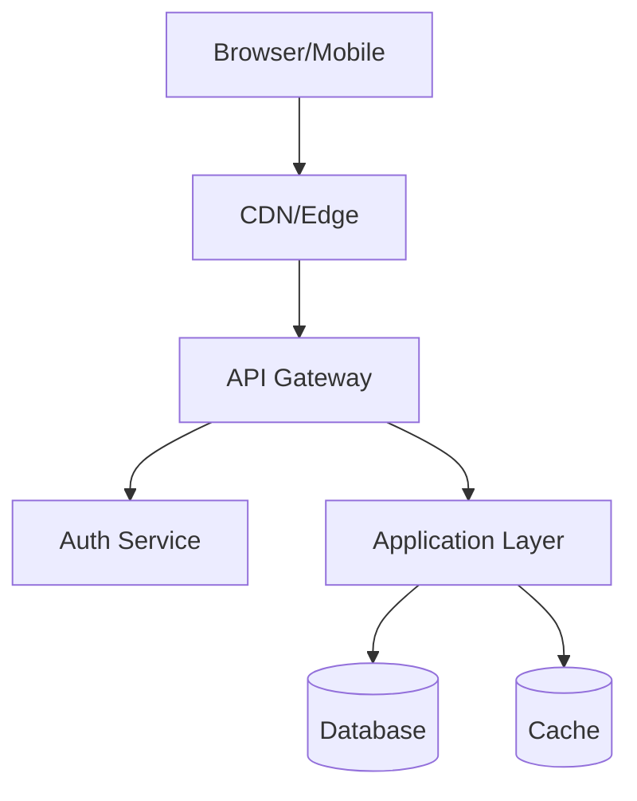

## Claude Code Enhanced Features

This skill includes the following Claude Code-specific enhancements:

## Input

$ARGUMENTS

If no argument provided, read `docs/project-brief.md` in the current project.

## Progress Tracking

Use TaskCreate to track architecture phases:

```
TaskCreate: "Review project brief" → read and understand requirements
TaskCreate: "Select tech stack" → research and decide
TaskCreate: "Design data model" → entities, relationships, schemas
TaskCreate: "Design API contracts" → endpoints, auth strategy
TaskCreate: "Draft architecture document" → write docs/architecture.md
```

## Research Enhancement

Use WebSearch and Context7 for tech stack validation:

```
WebSearch: "[chosen framework] production SaaS 2026 best practices"
WebSearch: "[database choice] vs [alternative] for [use case]"
```

Use Context7 to validate current API patterns for chosen frameworks before specifying them.

## Architecture Diagram

Generate Mermaid diagrams inline in docs/architecture.md:



## Quality Gate (Stop Hook)

When you attempt to stop, an automated agent verifies:
- `docs/architecture.md` exists with all required sections
- Tech stack choices have rationale (why this, not that)
- Data models are defined (not just described)
- At least 5 API endpoints specified with methods and paths

**Blocked example:**
```
⚠️ Architecture incomplete:
- Missing: System Architecture Diagram
- Missing: Security Considerations section
- Tech Stack section lacks rationale (just lists choices)
Cannot complete until all sections are substantive.
```

## Plan Mode Integration

For complex architectural decisions (multiple viable approaches), use EnterPlanMode to present options to the user before deciding:

```
EnterPlanMode when:
- Choosing between >2 database options
- Deciding between monolith vs microservices
- Auth architecture has multiple valid approaches
```
