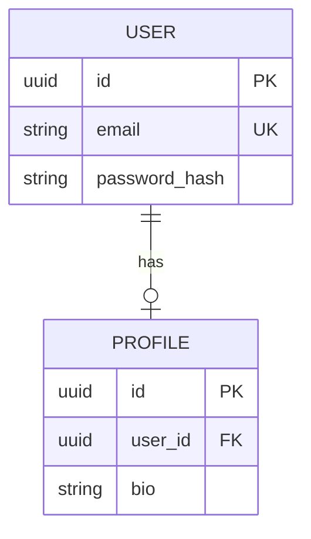
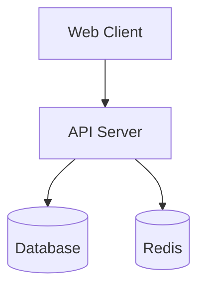
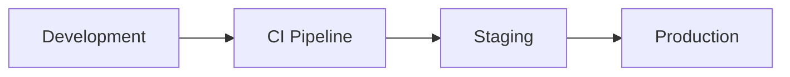
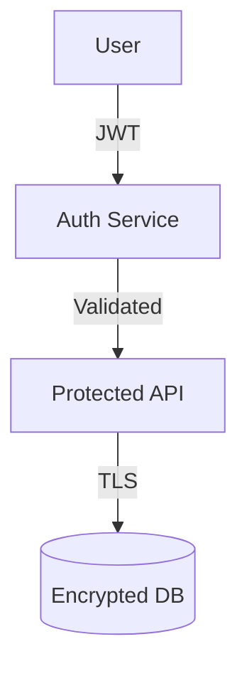

# Mermaid Patterns

Mermaid syntax reference for each supported diagram type.

## ER Diagram (`er`)

Entity-Relationship diagram from database models.

**Detects**: Tables and entities, columns with data types, primary keys, foreign keys, relationships, constraints.



### Supported ORMs

**Python ORMs**: SQLAlchemy, Django, Tortoise, SQLModel, Peewee

**JS/TS ORMs**: Prisma, TypeORM, Sequelize, Mongoose

**Other**: GORM (Go), ActiveRecord (Ruby)

### What to Extract

- Tables/entities
- Columns with types
- Relationships (one-to-one, one-to-many, many-to-many)
- Constraints (PK, FK, unique)

### For ER Diagrams Specifically

```
Agent 1 - Find Models:
- prompt: "Find all ORM model/entity files. Extract table names and column definitions."
- subagent_type: "Explore"

Agent 2 - Find Relationships:
- prompt: "In the model files found, identify all foreign keys and relationship decorators. Map actual relationships."
- subagent_type: "Explore"

Only include entities and relationships that both agents confirm exist.
```

## Architecture Diagram (`arch`)

System architecture and component relationships.

**Detects**: Services and modules, API endpoints, databases, caches, message queues, external services.



## Deployment Diagram (`deployment`)

Deployment infrastructure and CI/CD.

**Detects**: Docker containers, Kubernetes resources, cloud services, CI/CD pipeline stages, environment configurations.



## Security Diagram (`security`)

Security architecture and data flow.

**Detects**: Authentication flows, authorization boundaries, encryption points, security controls, trust boundaries.



## Example Output

```
ER Diagram Generated

Detected: 5 entities, 12 relationships
File: docs/data-model.md

Entities Found:
  User (SQLAlchemy model)
  Profile (SQLAlchemy model)
  Role (SQLAlchemy model)
  Permission (SQLAlchemy model)
  UserRole (junction table)

Relationships:
  User -> Profile (one-to-one)
  User -> UserRole (one-to-many)
  Role -> UserRole (one-to-many)
  Role -> Permission (many-to-many)

Next Steps:
  1. Review generated ER diagram
  2. Add entity descriptions if needed
  3. Update when schema changes
  4. Reference in architecture docs
```
