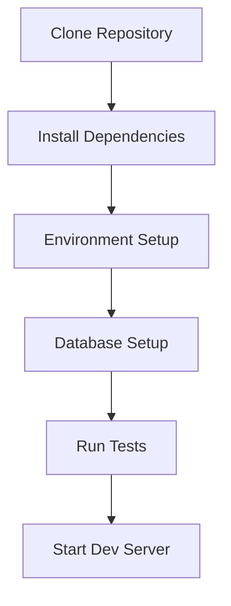

# {{PROJECT_NAME}} - Developer Onboarding Guide

**Last Updated:** {{DATE}}

Welcome to {{PROJECT_NAME}}. This guide gets a new developer to a running
local environment.

## Prerequisites

- {{TECH_STACK_REQUIREMENTS}}
- Git
- {{ADDITIONAL_ACCOUNTS}}

## Setup



### 1. Clone and Install

```bash
git clone {{REPOSITORY_URL}}
cd {{PROJECT_NAME}}
{{INSTALL_COMMANDS}}
```

### 2. Environment Configuration

```bash
cp .env.example .env
# Edit .env with local values
```

### 3. Database Setup

<!-- Delete this step if the project has no database. -->

```bash
{{DATABASE_SETUP_COMMANDS}}
```

### 4. Verify

```bash
{{TEST_COMMANDS}}
{{DEV_SERVER_COMMANDS}}
```

## Development Workflow

**Branches:** {{BRANCH_STRATEGY}}

**Commits:** {{COMMIT_CONVENTION}}

**Before opening a PR:**
- Run linters/formatters
- Run tests locally
- Update docs for API/behavior changes

## Project Structure

```
{{PROJECT_STRUCTURE}}
```

## Common Tasks

### Adding a Feature

1. Create a branch
2. Implement, following the project's coding standards ([contributing.md](contributing.md))
3. Add/update tests
4. Open a pull request

### Fixing a Bug

1. Reproduce with a failing test
2. Fix the root cause
3. Open a pull request

## Troubleshooting

<!-- One entry per real, recurring setup issue this project has (from issues,
     README caveats, or a wiki). Delete if none are documented. -->

**{{COMMON_ISSUE}}:** {{SOLUTION}}

## Resources

- [Architecture Documentation](architecture.md)
- [Contributing Guidelines](contributing.md)
- {{ADDITIONAL_RESOURCES}}

---

*Found something outdated here? Open a PR — this doc is meant to be kept current.*
