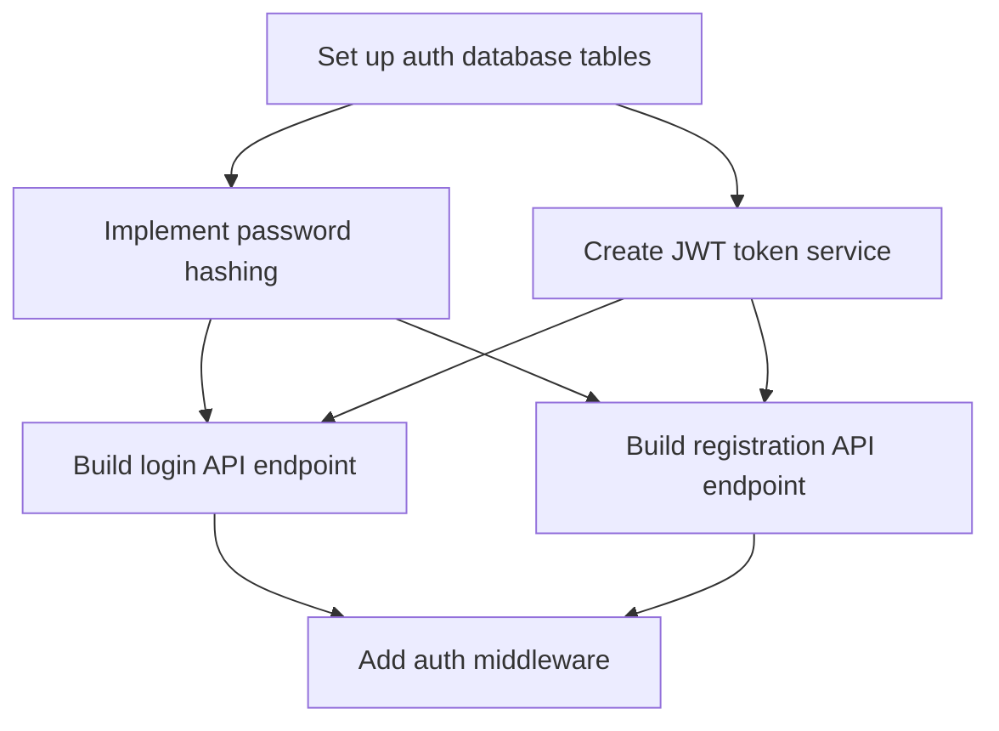

# Project Planner

Break a large, complex project into manageable tasks with clear dependencies, progress tracking, and a visual diagram.

## Project to Plan

$ARGUMENTS

## Planning Workflow

This skill has exactly two possible outputs: a full plan (Phases 0-4), or (when the scope fails the gate in Step 0.2) clarifying questions and nothing else. Never both in the same turn.

**Portability:** No `Task`/`TaskCreate` tools in this environment? Do the analysis yourself instead of delegating to an Explore agent, and track the resulting tasks as a plain markdown checklist (`- [ ] Task name, blocked by: ...`) instead of `TaskCreate` calls. The phases and the dependency diagram are the deliverable; the Task tool is just Claude Code's way of tracking them. In an eval or sandbox run, never call the real session `Task`/`TaskCreate`/`TaskUpdate`/`TaskList` tools: those mutate the operator's actual task list. If the prompt instead asks you to record intended calls into a file (e.g. `outputs/tasks.json`), do that instead and treat it as the graded deliverable.

### Phase 0: Project Analysis

**Step 0.1: Understand Project Scope**

Use a Haiku-powered Explore agent for token-efficient codebase analysis:

```
Use Task tool with Explore agent:
- prompt: "Analyze the project to understand:
    1. Read CLAUDE.md and README.md for project context
    2. Identify project type (web app, API, CLI, library, etc.)
    3. Map out major components and modules
    4. Note technology stack and frameworks
    5. Identify existing patterns and conventions
    6. Find similar completed features to reference
    Return a structured summary of the project architecture."
- subagent_type: "Explore"
- model: "haiku"  # Token-efficient for exploration
```

**Step 0.2: Scope Gate**

Check whether the request names a concrete deliverable and rough boundaries (what's in, what's out). If it doesn't (e.g. "improve the app", "make things better", "plan our roadmap" with no target named), stop. End the response with 2-3 clarifying questions (via `AskUserQuestion` or plain prose) about the concrete deliverable, scope boundaries, or target outcome, and produce nothing else: no task breakdown, no `TaskCreate` calls, no Mermaid diagram, no files. A 25-task plan built on invented scope is worse than no plan, because the user must now audit every task against what they actually meant, instead of just answering the question. Do not soften this into "ask, then proceed with reasonable assumptions anyway": the questions are the entire response.

If the deliverable and boundaries are clear but secondary details are missing (timeline, tech stack preference, team size), that's not a scope gate failure: ask about those with `AskUserQuestion`, flag the assumption you're using if the user doesn't answer, and continue to Phase 1.

### Phase 1: Task Breakdown

Break the project into 3-7 major milestones (significant deliverables or phases), then create tasks under each milestone.

**Task Granularity Guidelines**:
- **Too large**: "Build the authentication system" (breaks into 10+ subtasks)
- **Too small**: "Import bcrypt library" (trivial step within a larger task)
- **Just right**: "Implement password hashing with bcrypt and validation" (aim for 2-8 hours of work per task)

### Phase 2: Dependency Mapping

For each task, determine its prerequisites (`blockedBy`), what it blocks, and what can run in parallel. Most real dependency graphs are composed from a few recurring shapes: sequential chain, parallel-then-converge, diamond, staged/time-gated rollout, multi-team fan-out. See [references/dependency-shapes.md](references/dependency-shapes.md) when the structure isn't a plain chain.

**Worked example** (auth system):
```
TaskCreate: subject="Set up auth database tables", description="..."
TaskCreate: subject="Implement password hashing", description="..."
TaskCreate: subject="Create JWT token service", description="..."
TaskCreate: subject="Build login API endpoint", description="..."
TaskCreate: subject="Build registration API endpoint", description="..."
TaskCreate: subject="Add auth middleware", description="..."

TaskUpdate: { taskId: "2", addBlockedBy: ["1"] }         # hashing needs DB schema
TaskUpdate: { taskId: "3", addBlockedBy: ["1"] }         # JWT needs DB schema
TaskUpdate: { taskId: "4", addBlockedBy: ["2", "3"] }    # login needs hash + JWT
TaskUpdate: { taskId: "5", addBlockedBy: ["2", "3"] }    # registration needs hash + JWT
TaskUpdate: { taskId: "6", addBlockedBy: ["4", "5"] }    # middleware after endpoints
```

### Phase 3: Visualization

Don't start this phase until every task in the plan has its `blockedBy` relations recorded (real `TaskUpdate` calls, or the `outputs/tasks.json` equivalent in a sandboxed run). That recorded data is the single source of truth for both the diagram and the critical path: never hand-draw an edge or a chain from memory/intuition about what "should" depend on what. A diagram that disagrees with the actual dependencies is worse than no diagram: downstream work gets sequenced off the picture, not the data, and nobody notices until it breaks.

**Step 3.1: Draw the diagram mechanically from recorded edges.** For every `addBlockedBy` entry recorded in Phase 2, emit exactly one Mermaid edge, `<blocker> --> <task>`. One recorded relation, one edge, no more, no fewer. A task with an empty `addBlockedBy` gets no incoming edge, full stop, even if it feels like it should logically follow something.



**Step 3.2: Compute the critical path by walking those same edges.** Find the longest chain (by task count, or by summed duration if the user gave time estimates) from an unblocked task to a task nothing else depends on, using only edges drawn in Step 3.1. State it as task names:
```
Critical Path: Database → Password Hashing → Login API → Middleware
Estimated Duration: [X days/weeks, only if the user gave time estimates]
```

**Step 3.3: Self-check before presenting.** Check both directions: every Mermaid edge maps to a recorded `addBlockedBy` relation, and every recorded `addBlockedBy` relation appears as an edge. Same check for the critical path: every link in the stated chain must be an edge from Step 3.1. Fix any mismatch in the diagram/path (never in the underlying data) and re-check before showing it to the user.

### Phase 4: Progress Tracking

After creating all tasks and dependencies, run `TaskList` to show the full plan (or, in a sandboxed run recording to `outputs/tasks.json`, record the intended `TaskList` call there). As implementation proceeds, update task status via `TaskUpdate` (`in_progress` → `completed`) and re-run `TaskList` to show progress. If a task becomes blocked by an external factor, record it in `TaskUpdate`'s `metadata` and use `AskUserQuestion` to surface it rather than silently stalling.

## Output Format

Provide a summary including:
- Total number of tasks created
- Dependency graph visualization (Mermaid)
- Critical path analysis
- Estimated timeline (only if the user supplied time estimates, never invent durations)
- Next steps to start implementation
- Risk areas identified

## Usage Examples

```
project-planner Implement user authentication with OAuth2 and JWT
project-planner Refactor payment module to use strategy pattern
project-planner Fix memory leak in WebSocket connection handling
project-planner Migrate from REST API to GraphQL
```

## Best Practices

1. Start with discovery: understand the project before planning it
2. Right-size tasks: not "the whole feature," not "one import statement"
3. Make prerequisites explicit with `blockedBy`, not prose
4. Derive the diagram and critical path from recorded `blockedBy` data, never from memory: self-check both directions before presenting
5. Maximize parallel work where tasks are genuinely independent
6. Track progress with `TaskList`; adapt tasks/dependencies as requirements change
7. Capture rationale in task descriptions, not just the deliverable

## References

- [references/dependency-shapes.md](references/dependency-shapes.md): load when the dependency structure isn't a plain sequential chain (parallel/converge, diamond, staged rollout, multi-team fan-out)
