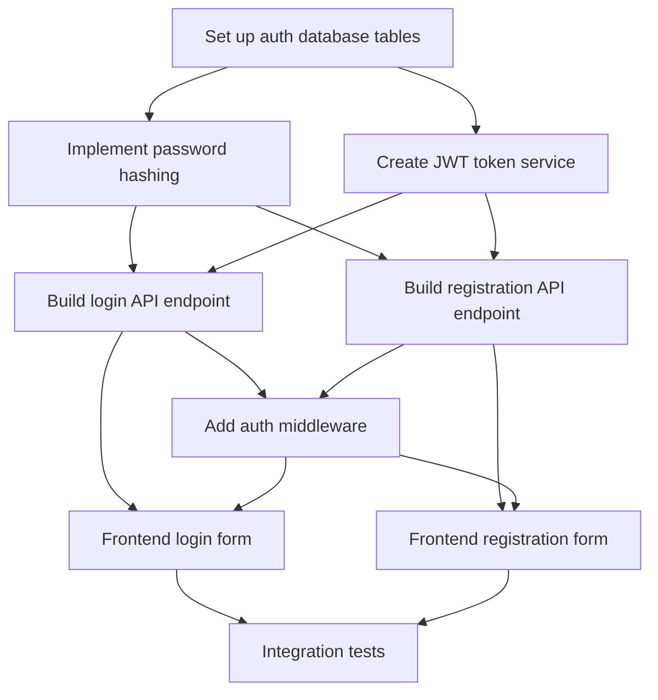

# Project Planner

Break a large, complex project into manageable tasks with clear dependencies, progress tracking, and a visual diagram.

## Project to Plan

$ARGUMENTS

## Planning Workflow

**Portability:** No `Task`/`TaskCreate` tools in this environment? Do the analysis yourself instead of delegating to an Explore agent, and track the resulting tasks as a plain checklist instead of `TaskCreate` calls. The phases and the dependency diagram are the deliverable; the Task tool is just Claude Code's way of tracking them.

### Phase 0: Project Analysis

**Step 0.1: Understand Project Scope**

Use a Haiku-powered Explore agent for token-efficient codebase analysis:

```
Use Task tool with Explore agent:
- prompt: "Analyze the project to understand:
    1. Read CLAUDE.md and README.md for project context
    2. Identify project type (web app, API, CLI, library, etc.)
    3. Map out major components and modules
    4. Note technology stack and frameworks
    5. Identify existing patterns and conventions
    6. Find similar completed features to reference
    Return a structured summary of the project architecture."
- subagent_type: "Explore"
- model: "haiku"  # Token-efficient for exploration
```

**Step 0.2: Clarify Requirements**

If the project description is vague or has multiple valid approaches, use `AskUserQuestion` to clarify:
- What are the must-have vs nice-to-have features?
- Are there specific architectural constraints?
- What's the target completion timeline?
- Should this integrate with existing systems?
- Are there specific technology preferences?

### Phase 1: Task Breakdown

**Step 1.1: Identify Major Milestones**

Break the project into 3-7 major milestones. Each milestone represents a significant deliverable or phase:

**Example for a new authentication system**:
1. Discovery & Planning
2. Database schema and migrations
3. Core authentication logic
4. API endpoints
5. Frontend integration
6. Testing & verification
7. Documentation & deployment

**Step 1.2: Create Tasks for Each Milestone**

For each milestone, create tasks that are:
- **Specific**: Clear deliverable and acceptance criteria
- **Measurable**: Can be marked completed objectively
- **Achievable**: Can be completed in a reasonable timeframe
- **Relevant**: Contributes to the milestone goal
- **Time-bound**: Not open-ended

**Task Granularity Guidelines**:
- **Too large**: "Build the authentication system" (breaks into 10+ subtasks)
- **Too small**: "Import bcrypt library" (trivial step within a larger task)
- **Just right**: "Implement password hashing with bcrypt and validation"

### Phase 2: Dependency Mapping

**Step 2.1: Identify Task Dependencies**

For each task, determine:
- **Prerequisites**: Which tasks must complete before this can start?
- **Blockers**: Which tasks does this one block?
- **Parallelizable**: Which tasks can run concurrently?

**Dependency Types**:
- **Sequential**: Task B requires output from Task A
- **Parallel**: Tasks A and B can run simultaneously
- **Convergence**: Tasks A and B must both complete before Task C

**Step 2.2: Set Up Task Dependencies**

```
# Example: Authentication system task chain
TaskCreate: subject="Set up auth database tables", description="..."
TaskCreate: subject="Implement password hashing", description="..."
TaskCreate: subject="Create JWT token service", description="..."
TaskCreate: subject="Build login API endpoint", description="..."
TaskCreate: subject="Build registration API endpoint", description="..."
TaskCreate: subject="Add auth middleware", description="..."
TaskCreate: subject="Frontend login form", description="..."
TaskCreate: subject="Frontend registration form", description="..."
TaskCreate: subject="Integration tests", description="..."

# Sequential dependencies
TaskUpdate: { taskId: "2", addBlockedBy: ["1"] }  # Hash needs DB schema
TaskUpdate: { taskId: "3", addBlockedBy: ["1"] }  # JWT needs DB schema
TaskUpdate: { taskId: "4", addBlockedBy: ["2", "3"] }  # Login needs hash + JWT
TaskUpdate: { taskId: "5", addBlockedBy: ["2", "3"] }  # Registration needs hash + JWT
TaskUpdate: { taskId: "6", addBlockedBy: ["4", "5"] }  # Middleware after endpoints
TaskUpdate: { taskId: "7", addBlockedBy: ["4", "6"] }  # Frontend needs API + middleware
TaskUpdate: { taskId: "8", addBlockedBy: ["5", "6"] }  # Frontend needs API + middleware
TaskUpdate: { taskId: "9", addBlockedBy: ["7", "8"] }  # Tests after all frontend
```

### Phase 3: Visualization

**Step 3.1: Generate Dependency Diagram**

Create a Mermaid diagram showing the task dependency graph:



**Diagram Guidelines**:
- Use clear, concise node labels
- Show critical path in a different color if possible
- Group related tasks visually
- Include milestone markers
- Add estimates if available

**Step 3.2: Document Critical Path**

Identify and highlight the critical path (longest sequential chain):
```
Critical Path: Database → Password Hashing → Login API → Middleware → Frontend Login → Tests
Estimated Duration: [X days/weeks]
```

### Phase 4: Task Templates

For common project types (web feature, bug fix, refactoring, API+frontend, DB migration, library integration), reuse the templates in [references/task-patterns.md](references/task-patterns.md) instead of reinventing a milestone list.

### Phase 5: Progress Tracking

**Step 5.1: Initial Task List**

After creating all tasks and dependencies, show the full plan:
```
TaskList
```

**Step 5.2: Track Implementation Progress**

As work progresses, update task status:
```
TaskUpdate: { taskId: "1", status: "in_progress" }
# ... work ...
TaskUpdate: { taskId: "1", status: "completed" }
TaskList  # Show updated progress
```

**Step 5.3: Handle Blockers**

If a task becomes blocked by external factors:
```
TaskUpdate:
  taskId: "4"
  metadata: { blocked_reason: "Waiting for design mockups from UI team" }
```

Use `AskUserQuestion` to notify stakeholders and get resolution timeline.

## Advanced Features

For very large projects (epics with milestone hierarchies), risk tracking, or team resource allocation, encode it in task `metadata` (e.g. `{ type: "milestone", epic: "..." }`, `{ risk: "high", risk_reason: "..." }`, `{ assigned_to: "...", estimated_hours: N }`) — most projects don't need this, so only reach for it when a real project asks for epics/risk/ownership tracking.

## Output Format

Provide a summary including:
- Total number of tasks created
- Dependency graph visualization (Mermaid)
- Critical path analysis
- Estimated timeline (if applicable)
- Next steps to start implementation
- Risk areas identified

## Usage Examples

```bash
# Plan a new feature
project-planner Implement user authentication with OAuth2 and JWT

# Plan a refactoring
project-planner Refactor payment module to use strategy pattern

# Plan a bug fix (for complex bugs)
project-planner Fix memory leak in WebSocket connection handling

# Plan a migration
project-planner Migrate from REST API to GraphQL
```

## Best Practices

1. **Start with discovery**: Always understand the project before planning
2. **Right-size tasks**: Not too big, not too small (aim for 2-8 hours per task)
3. **Clear dependencies**: Make prerequisites explicit with `blockedBy`
4. **Identify parallel work**: Maximize concurrent progress
5. **Visualize the plan**: Mermaid diagrams help communicate structure
6. **Track progress**: Use `TaskList` regularly to show status
7. **Adapt as needed**: Update tasks and dependencies as requirements change
8. **Document decisions**: Use task descriptions to capture context and rationale

## References

For detailed patterns and examples:
- [references/task-patterns.md](references/task-patterns.md) - Reusable task breakdown patterns (web feature, bug fix, refactoring, API+frontend, DB migration, library integration)
- [references/dependency-examples.md](references/dependency-examples.md) - Complex dependency examples
