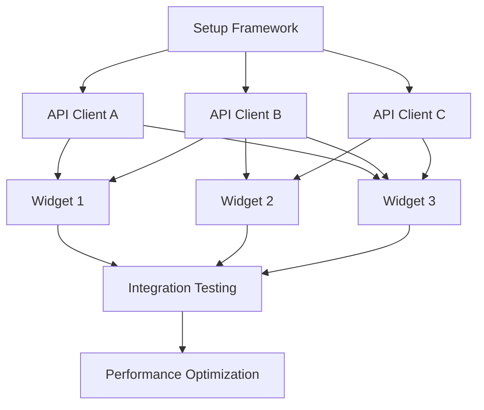

# Complex Dependency Examples

Real-world examples of complex task dependencies with detailed explanations.

## Example 1: Parallel with Multiple Convergence Points

**Scenario**: Building a dashboard with multiple data sources

**Tasks**:
1. Set up dashboard framework
2. Create API client for Service A
3. Create API client for Service B
4. Create API client for Service C
5. Build Widget 1 (uses Service A + B)
6. Build Widget 2 (uses Service B + C)
7. Build Widget 3 (uses all services)
8. Integration testing
9. Performance optimization

**Dependency Setup**:
```
TaskCreate: subject="Set up dashboard framework", description="..."
TaskCreate: subject="Create API client for Service A", description="..."
TaskCreate: subject="Create API client for Service B", description="..."
TaskCreate: subject="Create API client for Service C", description="..."
TaskCreate: subject="Build Widget 1", description="Uses Service A + B"
TaskCreate: subject="Build Widget 2", description="Uses Service B + C"
TaskCreate: subject="Build Widget 3", description="Uses all services"
TaskCreate: subject="Integration testing", description="..."
TaskCreate: subject="Performance optimization", description="..."

# Framework must complete first
TaskUpdate: { taskId: "2", addBlockedBy: ["1"] }
TaskUpdate: { taskId: "3", addBlockedBy: ["1"] }
TaskUpdate: { taskId: "4", addBlockedBy: ["1"] }

# Widgets depend on their API clients
TaskUpdate: { taskId: "5", addBlockedBy: ["2", "3"] }  # Widget 1 needs A + B
TaskUpdate: { taskId: "6", addBlockedBy: ["3", "4"] }  # Widget 2 needs B + C
TaskUpdate: { taskId: "7", addBlockedBy: ["2", "3", "4"] }  # Widget 3 needs all

# Testing after all widgets complete
TaskUpdate: { taskId: "8", addBlockedBy: ["5", "6", "7"] }

# Optimization after testing
TaskUpdate: { taskId: "9", addBlockedBy: ["8"] }
```

**Mermaid Diagram**:


**Parallelization**:
- API clients (2, 3, 4) can be built in parallel after 1
- Widgets can be built as soon as their dependencies are ready
- Maximum parallelism: 3 API clients + potentially 2-3 widgets

## Example 2: Staged Rollout with Feature Flags

**Scenario**: Deploying a major feature with gradual rollout

**Tasks**:
1. Implement core feature
2. Add feature flag system
3. Write comprehensive tests
4. Deploy to internal staging
5. Deploy to beta users (10%)
6. Monitor metrics for 24h
7. Deploy to 50% of users
8. Monitor metrics for 48h
9. Deploy to 100% of users
10. Remove feature flag code

**Dependency Setup**:
```
TaskCreate: subject="Implement core feature", description="..."
TaskCreate: subject="Add feature flag system", description="..."
TaskCreate: subject="Write comprehensive tests", description="..."
TaskCreate: subject="Deploy to internal staging", description="..."
TaskCreate: subject="Deploy to beta users (10%)", description="..."
TaskCreate: subject="Monitor metrics for 24h", description="..."
TaskCreate: subject="Deploy to 50% of users", description="..."
TaskCreate: subject="Monitor metrics for 48h", description="..."
TaskCreate: subject="Deploy to 100% of users", description="..."
TaskCreate: subject="Remove feature flag code", description="..."

# Feature and flags in parallel
TaskUpdate: { taskId: "3", addBlockedBy: ["1", "2"] }  # Tests after both

# Strict sequential deployment chain
TaskUpdate: { taskId: "4", addBlockedBy: ["3"] }
TaskUpdate: { taskId: "5", addBlockedBy: ["4"] }
TaskUpdate: { taskId: "6", addBlockedBy: ["5"] }
TaskUpdate: { taskId: "7", addBlockedBy: ["6"] }
TaskUpdate: { taskId: "8", addBlockedBy: ["7"] }
TaskUpdate: { taskId: "9", addBlockedBy: ["8"] }
TaskUpdate: { taskId: "10", addBlockedBy: ["9"] }
```

**Key Point**: Monitoring tasks must complete before next deployment stage. Use time-based blocking where needed.

## Example 3: Multi-Team Coordination

**Scenario**: Feature requiring backend, frontend, and mobile teams

**Tasks**:
1. Define API contract (all teams)
2. Backend: Implement API
3. Backend: Write API tests
4. Frontend: Build UI component
5. Frontend: Integrate with API
6. Mobile: Build screens
7. Mobile: Integrate with API
8. Backend: Deploy API to staging
9. Frontend: Deploy to staging
10. Mobile: Build test APK
11. Cross-team integration testing
12. Production deployment

**Dependency Setup**:
```
TaskCreate: subject="Define API contract", description="..."
TaskCreate: subject="Backend: Implement API", description="..."
TaskCreate: subject="Backend: Write API tests", description="..."
TaskCreate: subject="Frontend: Build UI component", description="..."
TaskCreate: subject="Frontend: Integrate with API", description="..."
TaskCreate: subject="Mobile: Build screens", description="..."
TaskCreate: subject="Mobile: Integrate with API", description="..."
TaskCreate: subject="Backend: Deploy API to staging", description="..."
TaskCreate: subject="Frontend: Deploy to staging", description="..."
TaskCreate: subject="Mobile: Build test APK", description="..."
TaskCreate: subject="Cross-team integration testing", description="..."
TaskCreate: subject="Production deployment", description="..."

# All teams can start after contract is defined
TaskUpdate: { taskId: "2", addBlockedBy: ["1"] }
TaskUpdate: { taskId: "4", addBlockedBy: ["1"] }
TaskUpdate: { taskId: "6", addBlockedBy: ["1"] }

# Backend sequential
TaskUpdate: { taskId: "3", addBlockedBy: ["2"] }
TaskUpdate: { taskId: "8", addBlockedBy: ["3"] }

# Frontend sequential
TaskUpdate: { taskId: "5", addBlockedBy: ["4"] }
TaskUpdate: { taskId: "9", addBlockedBy: ["5", "8"] }  # Needs backend staging

# Mobile sequential
TaskUpdate: { taskId: "7", addBlockedBy: ["6"] }
TaskUpdate: { taskId: "10", addBlockedBy: ["7", "8"] }  # Needs backend staging

# Integration testing after all staging deployments
TaskUpdate: { taskId: "11", addBlockedBy: ["8", "9", "10"] }

# Production after integration tests pass
TaskUpdate: { taskId: "12", addBlockedBy: ["11"] }
```

**Metadata for Team Tracking**:
```
# Add team ownership to tasks
TaskUpdate: { taskId: "2", metadata: { team: "backend", assigned_to: "alice" } }
TaskUpdate: { taskId: "4", metadata: { team: "frontend", assigned_to: "bob" } }
TaskUpdate: { taskId: "6", metadata: { team: "mobile", assigned_to: "charlie" } }
```

## Example 4: A/B Testing Implementation

**Scenario**: Implementing two variants of a feature for comparison

**Tasks**:
1. Design experiment parameters
2. Set up analytics tracking
3. Implement Variant A
4. Implement Variant B
5. Add variant routing logic
6. Test Variant A
7. Test Variant B
8. Deploy to staging
9. Run experiment (7 days)
10. Analyze results
11. Deploy winning variant
12. Remove losing variant code

**Dependency Setup**:
```
TaskCreate: subject="Design experiment parameters", description="..."
TaskCreate: subject="Set up analytics tracking", description="..."
TaskCreate: subject="Implement Variant A", description="..."
TaskCreate: subject="Implement Variant B", description="..."
TaskCreate: subject="Add variant routing logic", description="..."
TaskCreate: subject="Test Variant A", description="..."
TaskCreate: subject="Test Variant B", description="..."
TaskCreate: subject="Deploy to staging", description="..."
TaskCreate: subject="Run experiment (7 days)", description="..."
TaskCreate: subject="Analyze results", description="..."
TaskCreate: subject="Deploy winning variant", description="..."
TaskCreate: subject="Remove losing variant code", description="..."

# Tracking after design
TaskUpdate: { taskId: "2", addBlockedBy: ["1"] }

# Variants in parallel after tracking
TaskUpdate: { taskId: "3", addBlockedBy: ["2"] }
TaskUpdate: { taskId: "4", addBlockedBy: ["2"] }

# Routing after both variants
TaskUpdate: { taskId: "5", addBlockedBy: ["3", "4"] }

# Testing in parallel
TaskUpdate: { taskId: "6", addBlockedBy: ["5"] }
TaskUpdate: { taskId: "7", addBlockedBy: ["5"] }

# Deploy after both tests pass
TaskUpdate: { taskId: "8", addBlockedBy: ["6", "7"] }

# Experiment after deployment
TaskUpdate: { taskId: "9", addBlockedBy: ["8"] }

# Analysis after experiment
TaskUpdate: { taskId: "10", addBlockedBy: ["9"] }

# Deploy winner after analysis
TaskUpdate: { taskId: "11", addBlockedBy: ["10"] }

# Cleanup after deployment
TaskUpdate: { taskId: "12", addBlockedBy: ["11"] }
```

**Time-Based Blocking**: Task 9 (run experiment) has a 7-day duration before Task 10 can start.

## Example 5: Legacy Code Migration

**Scenario**: Migrating from old system to new system with dual-running period

**Tasks**:
1. Analyze legacy system
2. Design new system architecture
3. Implement new system (Phase 1)
4. Add feature parity tests
5. Deploy new system in shadow mode
6. Run dual systems for 30 days
7. Compare outputs and fix discrepancies
8. Route 10% traffic to new system
9. Monitor for 7 days
10. Route 50% traffic to new system
11. Monitor for 7 days
12. Route 100% traffic to new system
13. Monitor for 14 days
14. Decommission legacy system

**Dependency Setup**:
```
TaskCreate: subject="Analyze legacy system", description="..."
TaskCreate: subject="Design new system architecture", description="..."
TaskCreate: subject="Implement new system (Phase 1)", description="..."
TaskCreate: subject="Add feature parity tests", description="..."
TaskCreate: subject="Deploy new system in shadow mode", description="..."
TaskCreate: subject="Run dual systems for 30 days", description="..."
TaskCreate: subject="Compare outputs and fix discrepancies", description="..."
TaskCreate: subject="Route 10% traffic to new system", description="..."
TaskCreate: subject="Monitor for 7 days", description="..."
TaskCreate: subject="Route 50% traffic to new system", description="..."
TaskCreate: subject="Monitor for 7 days", description="..."
TaskCreate: subject="Route 100% traffic to new system", description="..."
TaskCreate: subject="Monitor for 14 days", description="..."
TaskCreate: subject="Decommission legacy system", description="..."

# Strict sequential chain with long monitoring periods
TaskUpdate: { taskId: "2", addBlockedBy: ["1"] }
TaskUpdate: { taskId: "3", addBlockedBy: ["2"] }
TaskUpdate: { taskId: "4", addBlockedBy: ["3"] }
TaskUpdate: { taskId: "5", addBlockedBy: ["4"] }
TaskUpdate: { taskId: "6", addBlockedBy: ["5"] }
TaskUpdate: { taskId: "7", addBlockedBy: ["6"] }
TaskUpdate: { taskId: "8", addBlockedBy: ["7"] }
TaskUpdate: { taskId: "9", addBlockedBy: ["8"] }
TaskUpdate: { taskId: "10", addBlockedBy: ["9"] }
TaskUpdate: { taskId: "11", addBlockedBy: ["10"] }
TaskUpdate: { taskId: "12", addBlockedBy: ["11"] }
TaskUpdate: { taskId: "13", addBlockedBy: ["12"] }
TaskUpdate: { taskId: "14", addBlockedBy: ["13"] }
```

**Metadata for Time Tracking**:
```
TaskUpdate: { taskId: "6", metadata: { duration_days: 30, start_date: "2025-01-15" } }
TaskUpdate: { taskId: "9", metadata: { duration_days: 7, traffic_percentage: 10 } }
TaskUpdate: { taskId: "11", metadata: { duration_days: 7, traffic_percentage: 50 } }
TaskUpdate: { taskId: "13", metadata: { duration_days: 14, traffic_percentage: 100 } }
```

## Example 6: Security Audit Remediation

**Scenario**: Fixing multiple security vulnerabilities with prioritization

**Tasks**:
1. Conduct security audit
2. Categorize vulnerabilities (Critical, High, Medium, Low)
3. Fix Critical: SQL Injection in login
4. Fix Critical: XSS in user profile
5. Deploy critical fixes to production
6. Fix High: CSRF protection missing
7. Fix High: Weak password policy
8. Deploy high-priority fixes
9. Fix Medium: Missing rate limiting
10. Fix Medium: Outdated dependencies
11. Deploy medium-priority fixes
12. Schedule low-priority fixes for next sprint

**Dependency Setup**:
```
TaskCreate: subject="Conduct security audit", description="..."
TaskCreate: subject="Categorize vulnerabilities", description="..."
TaskCreate: subject="Fix Critical: SQL Injection", description="..."
TaskCreate: subject="Fix Critical: XSS", description="..."
TaskCreate: subject="Deploy critical fixes", description="..."
TaskCreate: subject="Fix High: CSRF protection", description="..."
TaskCreate: subject="Fix High: Weak password policy", description="..."
TaskCreate: subject="Deploy high-priority fixes", description="..."
TaskCreate: subject="Fix Medium: Rate limiting", description="..."
TaskCreate: subject="Fix Medium: Dependencies", description="..."
TaskCreate: subject="Deploy medium-priority fixes", description="..."
TaskCreate: subject="Schedule low-priority fixes", description="..."

# Categorize after audit
TaskUpdate: { taskId: "2", addBlockedBy: ["1"] }

# Critical fixes in parallel after categorization
TaskUpdate: { taskId: "3", addBlockedBy: ["2"] }
TaskUpdate: { taskId: "4", addBlockedBy: ["2"] }

# Deploy critical after both fixes complete
TaskUpdate: { taskId: "5", addBlockedBy: ["3", "4"] }

# High-priority fixes in parallel after critical deployment
TaskUpdate: { taskId: "6", addBlockedBy: ["5"] }
TaskUpdate: { taskId: "7", addBlockedBy: ["5"] }

# Deploy high after both fixes complete
TaskUpdate: { taskId: "8", addBlockedBy: ["6", "7"] }

# Medium-priority fixes in parallel after high deployment
TaskUpdate: { taskId: "9", addBlockedBy: ["8"] }
TaskUpdate: { taskId: "10", addBlockedBy: ["8"] }

# Deploy medium after both fixes complete
TaskUpdate: { taskId: "11", addBlockedBy: ["9", "10"] }

# Schedule remaining after medium deployment
TaskUpdate: { taskId: "12", addBlockedBy: ["11"] }
```

**Metadata for Priority Tracking**:
```
TaskUpdate: { taskId: "3", metadata: { severity: "critical", cvss: 9.8 } }
TaskUpdate: { taskId: "4", metadata: { severity: "critical", cvss: 8.9 } }
TaskUpdate: { taskId: "6", metadata: { severity: "high", cvss: 7.5 } }
TaskUpdate: { taskId: "7", metadata: { severity: "high", cvss: 7.2 } }
```

## Dependency Pattern Reference

### Sequential Chain
```
A → B → C → D
Each task must complete before the next starts
```

### Parallel Split
```
A → (B || C || D) → E
B, C, D can run simultaneously after A
E waits for all three to complete
```

### Diamond Pattern
```
    A
   / \
  B   C
   \ /
    D
B and C run in parallel
D waits for both
```

### Staged Rollout
```
A → B → wait → C → wait → D
Includes time-based blocking between stages
```

### Multi-Team Coordination
```
       A (contract)
      /|\
     / | \
    B  C  D (parallel team work)
     \ | /
      \|/
       E (integration)
```

## Tips for Complex Dependencies

1. **Use metadata liberally** to track context (team, priority, duration, risk)
2. **Visualize before implementing** with Mermaid diagrams
3. **Identify critical path** - the longest sequential chain determines minimum project duration
4. **Maximize parallelization** where tasks are truly independent
5. **Add time-based blockers** for monitoring/waiting periods in metadata
6. **Track external dependencies** in task descriptions and metadata
7. **Use task ownership** to coordinate multi-team work
8. **Document assumptions** in task descriptions to prevent misunderstandings
