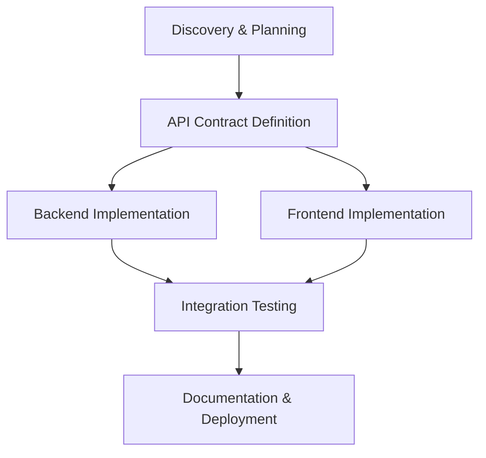

# Reusable Task Patterns

Common project patterns with pre-defined task breakdowns and dependencies.

## Web Application Feature

### Pattern: Full-Stack Feature

**Components**: Backend API + Frontend UI + Tests

**Task Breakdown**:
```
1. Discovery & Planning
   - Understand requirements
   - Discover project structure
   - Identify integration points

2. API Contract Definition
   - Design API endpoints
   - Define request/response schemas
   - Document in OpenAPI/Swagger

3. Backend Implementation (parallel after 2)
   - Implement API endpoints
   - Add validation
   - Write unit tests

4. Frontend Implementation (parallel after 2)
   - Create UI components
   - Integrate with API
   - Write component tests

5. Integration Testing (after 3 and 4)
   - E2E test flows
   - Error handling tests
   - Performance tests

6. Documentation & Deployment
   - API documentation
   - User documentation
   - Deployment configuration
```

**Dependency Chain**:
```
1 → 2 → (3 || 4) → 5 → 6
```

**Mermaid Diagram**:


## Database Changes

### Pattern: Schema Migration

**Components**: Schema design + Migration script + Code updates + Tests

**Task Breakdown**:
```
1. Analyze Current Schema
   - Document existing tables/columns
   - Identify affected queries
   - Note dependencies

2. Design New Schema
   - Create migration plan
   - Plan backward compatibility
   - Review with stakeholders

3. Write Migration Script
   - Create up migration
   - Create down migration (rollback)
   - Test on local DB

4. Update ORM Models
   - Update model definitions
   - Update relationships
   - Update validators

5. Update Application Code
   - Modify queries
   - Update business logic
   - Handle migration states

6. Update Tests
   - Update fixtures
   - Update test data
   - Add migration tests

7. Staging Deployment
   - Test migration on staging
   - Verify data integrity
   - Performance testing

8. Production Deployment
   - Backup production DB
   - Run migration
   - Monitor for issues
```

**Dependency Chain** (strict sequential):
```
1 → 2 → 3 → 4 → 5 → 6 → 7 → 8
```

## Library Integration

### Pattern: Third-Party Library

**Components**: Research + Proof of concept + Integration + Documentation

**Task Breakdown**:
```
1. Research Library
   - Use Context7 to get latest docs
   - Review examples and patterns
   - Check compatibility

2. Create Proof of Concept
   - Minimal working example
   - Test key features
   - Identify issues

3. Design Integration
   - Plan architecture
   - Define interfaces
   - Consider error handling

4. Implement Integration
   - Add library to project
   - Create wrapper/adapter
   - Implement features

5. Write Tests
   - Unit tests for wrapper
   - Integration tests
   - Mock external dependencies

6. Document Usage
   - Code comments
   - README updates
   - Usage examples
```

**Dependency Chain**:
```
1 → 2 → 3 → 4 → 5 → 6
```

## Refactoring Project

### Pattern: Large-Scale Refactoring

**Components**: Analysis + Tests + Incremental changes + Verification

**Task Breakdown**:
```
1. Identify Refactoring Scope
   - Code smells analysis
   - Architectural issues
   - Performance bottlenecks

2. Write Characterization Tests
   - Capture current behavior
   - Ensure test coverage >80%
   - Document edge cases

3. Plan Refactoring Strategy
   - Break into small steps
   - Identify safe refactorings
   - Plan commit strategy

4. Extract Methods/Classes
   - Small, reversible changes
   - Commit after each step
   - Run tests after each commit

5. Reorganize Structure
   - Move files if needed
   - Update imports
   - Update build config

6. Simplify Logic
   - Remove duplication
   - Improve naming
   - Reduce complexity

7. Final Verification
   - All tests pass
   - No behavior changes
   - Performance maintained

8. Update Documentation
   - Architecture docs
   - Code comments
   - Migration guide
```

**Dependency Chain**:
```
1 → 2 → 3 → 4 → 5 → 6 → 7 → 8
```

**Key Principle**: Commit after every green test phase, never with failing tests.

## Bug Fix (Complex)

### Pattern: Multi-Component Bug

**Components**: Reproduction + Analysis + Fix + Verification

**Task Breakdown**:
```
1. Reproduce Bug
   - Create failing test
   - Capture error output
   - Document symptoms

2. Locate Bug
   - Find exact file/line
   - Read surrounding context
   - Trace execution flow

3. Analyze Impact
   - Find similar patterns
   - Identify affected code
   - Check for related bugs

4. Plan Fix
   - Design minimal fix
   - Consider edge cases
   - Get approval if complex

5. Implement Fix
   - Make targeted changes
   - Verify test passes
   - No over-engineering

6. Test for Regressions
   - Run full test suite
   - Manual testing if UI
   - Performance check

7. Document Fix
   - Update changelog
   - Add code comments
   - Create conventional commit
```

**Dependency Chain** (strict sequential):
```
1 → 2 → 3 → 4 → 5 → 6 → 7
```

## Performance Optimization

### Pattern: Performance Improvement

**Components**: Profiling + Analysis + Optimization + Verification

**Task Breakdown**:
```
1. Establish Baseline
   - Current performance metrics
   - Identify bottlenecks
   - Set target metrics

2. Profile Application
   - Use profiling tools
   - Identify hot paths
   - Measure resource usage

3. Research Optimizations
   - Best practices for bottleneck
   - Similar case studies
   - Trade-offs analysis

4. Plan Optimization Strategy
   - Prioritize high-impact areas
   - Plan incremental changes
   - Consider maintainability

5. Implement Optimizations
   - One optimization at a time
   - Measure after each change
   - Keep code readable

6. Benchmark Results
   - Compare to baseline
   - Verify targets met
   - Check for regressions

7. Update Documentation
   - Document optimizations
   - Add performance notes
   - Update deployment guide
```

**Dependency Chain**:
```
1 → 2 → 3 → 4 → 5 → 6 → 7
```

## API Development

### Pattern: REST API Endpoint

**Components**: Design + Implementation + Tests + Documentation

**Task Breakdown**:
```
1. Design Endpoint
   - Define HTTP method + path
   - Request/response schemas
   - Error responses

2. Implement Route Handler
   - Add route to router
   - Parse request
   - Basic validation

3. Implement Business Logic
   - Core functionality
   - Data processing
   - Error handling

4. Add Database Layer (if needed)
   - Write queries
   - Handle transactions
   - Optimize performance

5. Add Validation & Security
   - Input validation
   - Authentication
   - Authorization

6. Write Tests
   - Unit tests for logic
   - Integration tests
   - Error case tests

7. Document Endpoint
   - OpenAPI/Swagger spec
   - Usage examples
   - Error code reference
```

**Dependency Chain**:
```
1 → 2 → 3 → 4 → 5 → 6 → 7
```

**Parallel Opportunity**: Steps 6 and 7 can run concurrently if 5 is complete.

## Frontend Component

### Pattern: React/Vue Component

**Components**: Design + Component + Tests + Storybook

**Task Breakdown**:
```
1. Design Component API
   - Props interface
   - Event handlers
   - State management

2. Create Component Structure
   - File structure
   - Basic markup
   - Import dependencies

3. Implement Functionality
   - State management
   - Event handlers
   - Side effects

4. Add Styling
   - CSS/Tailwind
   - Responsive design
   - Accessibility

5. Write Component Tests
   - Render tests
   - Interaction tests
   - Edge case tests

6. Create Storybook Stories (optional)
   - Default state
   - Variants
   - Interactive controls

7. Integration Testing
   - Parent component integration
   - Real data flow
   - E2E scenarios
```

**Dependency Chain**:
```
1 → 2 → 3 → 4 → (5 || 6) → 7
```

## Microservice Development

### Pattern: New Microservice

**Components**: Design + Implementation + Deployment + Monitoring

**Task Breakdown**:
```
1. Design Service API
   - API contract
   - Communication protocol
   - Data models

2. Set Up Project Structure
   - Framework initialization
   - Dependencies
   - Configuration

3. Implement Core Logic
   - Business logic
   - Data access
   - Service integration

4. Add API Layer
   - REST/gRPC endpoints
   - Request validation
   - Error handling

5. Implement Database Layer
   - Schema design
   - Repositories/DAOs
   - Migrations

6. Add Tests
   - Unit tests
   - Integration tests
   - Contract tests

7. Add Observability
   - Logging
   - Metrics
   - Tracing

8. Containerization
   - Dockerfile
   - Docker Compose
   - Environment config

9. CI/CD Pipeline
   - Build pipeline
   - Test automation
   - Deployment config

10. Documentation
    - API docs
    - Architecture diagram
    - Runbook
```

**Dependency Chain**:
```
1 → 2 → 3 → 4 → 5 → 6 → 7 → 8 → 9 → 10
```

## Authentication System

### Pattern: User Authentication

**Components**: Database + Auth logic + API + Frontend

**Task Breakdown**:
```
1. Design Auth Schema
   - Users table
   - Sessions/tokens table
   - Permissions schema

2. Database Migrations
   - Create tables
   - Add indexes
   - Seed initial data

3. Implement Password Hashing
   - bcrypt/argon2 setup
   - Hashing utility
   - Validation utility

4. Create JWT Service
   - Token generation
   - Token verification
   - Refresh logic

5. Build Login Endpoint
   - Credentials validation
   - Token generation
   - Error handling

6. Build Registration Endpoint
   - Input validation
   - User creation
   - Welcome email (optional)

7. Build Logout Endpoint
   - Token invalidation
   - Session cleanup
   - Audit logging

8. Add Auth Middleware
   - Token verification
   - User context injection
   - Permission checks

9. Frontend Login Form
   - Form component
   - Validation
   - Error display

10. Frontend Registration Form
    - Form component
    - Validation
    - Success redirect

11. Integration Tests
    - Full auth flows
    - Security tests
    - Edge cases

12. Documentation
    - API documentation
    - Security best practices
    - User guide
```

**Dependency Chain**:
```
1 → 2 → (3 || 4) → (5 || 6 || 7) → 8 → (9 || 10) → 11 → 12
```

**Parallel Opportunities**:
- Steps 3 and 4 (hashing and JWT) are independent
- Steps 5, 6, 7 (endpoints) can be built in parallel after auth utilities
- Steps 9 and 10 (frontend forms) can be built in parallel after middleware
