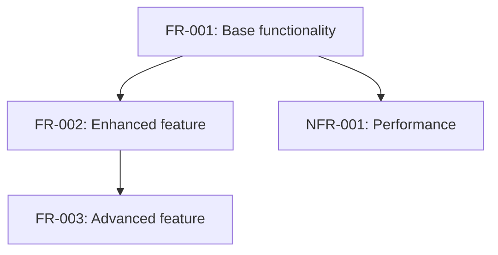
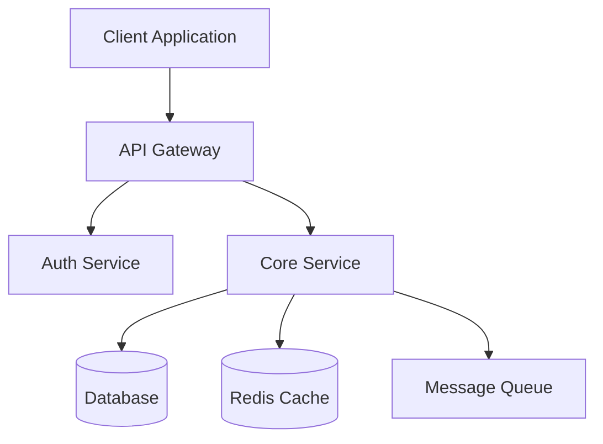
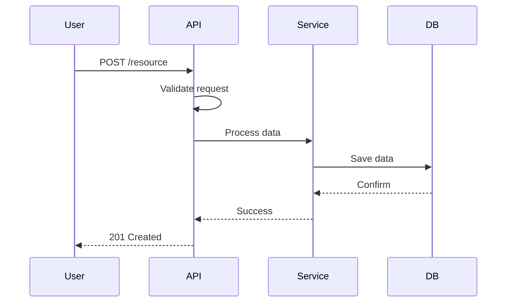
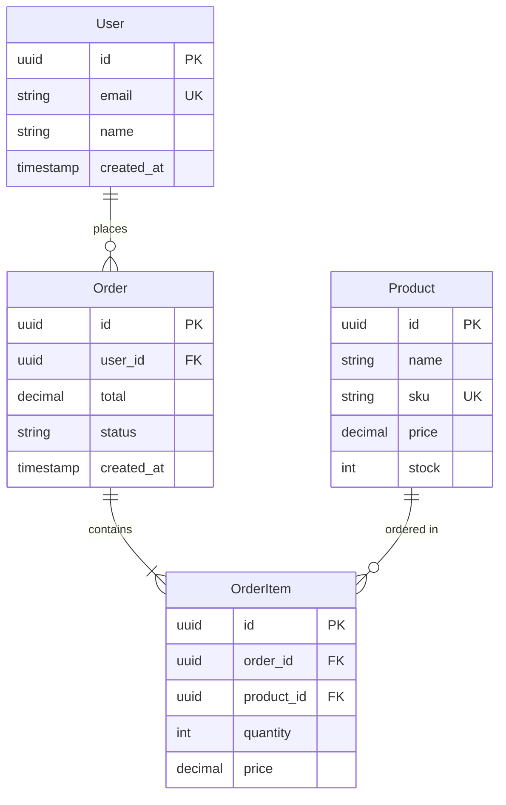
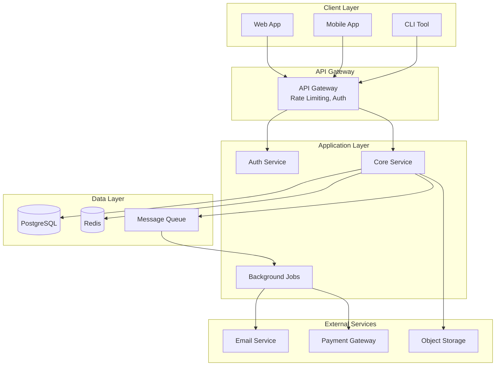
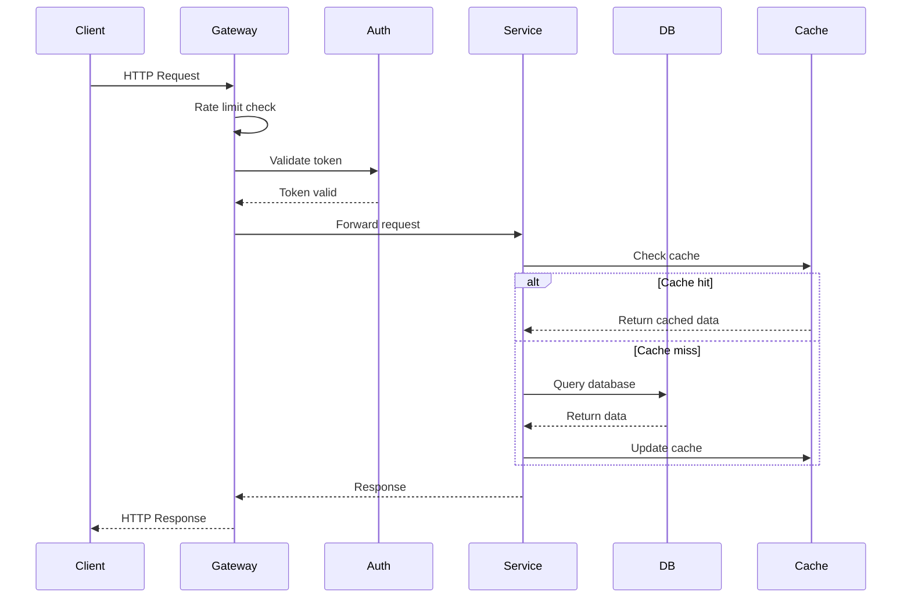
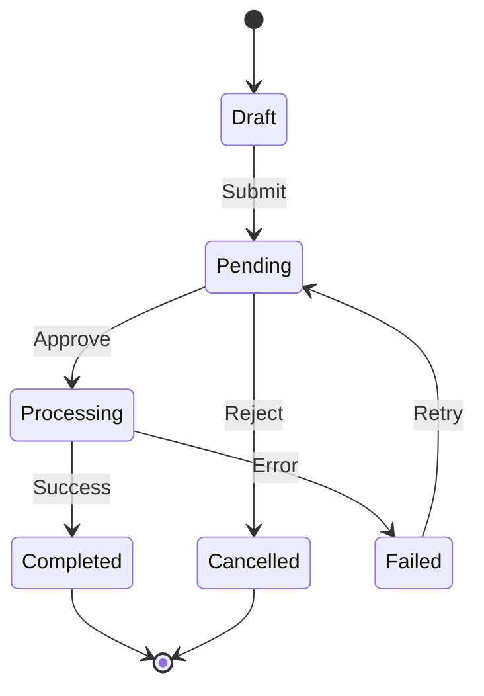
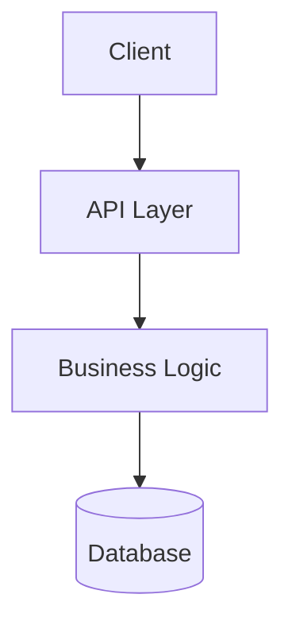

# Spec Templates Reference

This document provides file templates for all spec artifacts created during spec-driven design in the `team-implement` skill.

## Overview

The skill creates a `.specs/<short-id>/` directory for each task with two modes:

- **Full mode**: Complex projects with separate files for proposal, design, review, tasks, and decisions
- **Lite mode**: Simpler projects with combined files (brief, design, review, tasks)

All templates use TODO markers to guide content creation. Agents adapt sections based on project complexity.

---

## Input Digest Template

**Path**: `.specs/<short-id>/input-digest.md`

```markdown
# Input Digest: [Task Title]

**Short ID**: [short-id]
**Created**: YYYY-MM-DD
**Source Type**: [jira-ticket | github-issue | user-request | cli-args]

## Description

[Normalized description of what needs to be built/fixed/improved]

TODO: Extract and normalize the core request from the input source

## Acceptance Criteria

- [ ] TODO: List success criteria
- [ ] TODO: Define "done" conditions
- [ ] TODO: Include any explicit requirements from source

## Labels/Tags

TODO: Extract relevant labels (e.g., `enhancement`, `bug`, `security`, `high-priority`)

## Comments/Discussion

TODO: Summarize any relevant discussion, questions, or context from source

## Linked References

TODO: Include links to:
- Original issue/ticket URL
- Related PRs or issues
- Documentation references
- Design docs
```

---

## Global Specs Index Template

**Path**: `.specs/README.md`

```markdown
# Specs Index

Central index of all specification sessions for this repository.

## Active Sessions

| Short ID | Title | Status | Created | Team Lead | Mode |
|----------|-------|--------|---------|-----------|------|
| TODO | TODO | in-progress | TODO | TODO | full |

## Completed Sessions

| Short ID | Title | Status | Completed | Outcome |
|----------|-------|--------|-----------|---------|
| TODO | TODO | implemented | TODO | Merged in PR #123 |

## Session Status Legend

- `proposal` - Defining requirements and acceptance criteria
- `design` - Creating architecture and technical design
- `review` - Adversarial review and QA planning
- `implementation` - Building and testing
- `completed` - Implemented and merged
- `abandoned` - Work stopped (include reason)

## Quick Links

- [Active sessions](./)
- [Session templates](../skills/team-implement/references/spec-templates.md)
```

---

## Session Dashboard Template

**Path**: `.specs/<short-id>/README.md`

```markdown
# [Task Title]

**Short ID**: [short-id]
**Status**: [proposal | design | review | implementation | completed | abandoned]
**Mode**: [full | lite]

## Session Info

- **Created**: YYYY-MM-DD
- **Last Updated**: YYYY-MM-DD
- **Team Lead**: [agent-name or user]
- **Source**: [Link to original issue/ticket]

## Team Composition

TODO: List agents and their roles
- `proposal-agent` - Requirements and acceptance criteria
- `design-agent` - Architecture and technical design
- `adversary-agent` - Security and code review
- `implementation-agent` - Build and test

## Artifacts

### Proposal
TODO: Link to proposal artifacts
- [x] [Input Digest](./input-digest.md)
- [ ] [Project Brief](./proposal/brief.md) _(full mode)_ or [Brief](./brief.md) _(lite mode)_
- [ ] [Requirements](./proposal/requirements.md) _(full mode only)_
- [ ] [Acceptance Criteria](./proposal/acceptance-criteria.md) _(full mode only)_

### Design
TODO: Link to design artifacts
- [ ] [Architecture](./design/architecture.md) _(full mode)_ or [Design](./design.md) _(lite mode)_
- [ ] [API Contracts](./design/api-contracts.md) _(full mode only)_
- [ ] [Data Model](./design/data-model.md) _(full mode only)_
- [ ] [System Overview Diagram](./design/diagrams/system-overview.md) _(full mode only)_

### Review
TODO: Link to review artifacts
- [ ] [Adversary Report](./review/adversary-report.md) _(full mode)_ or [Review](./review.md) _(lite mode)_
- [ ] [Security Assessment](./review/security-assessment.md) _(full mode only)_
- [ ] [QA Plan](./review/qa-plan.md) _(full mode only)_

### Tasks
TODO: Link to task artifacts
- [ ] [Task Breakdown](./tasks/task-breakdown.md) _(full mode)_ or [Tasks](./tasks.md) _(lite mode)_
- [ ] [Task Graph](./tasks/task-graph.md) _(full mode only)_

### Decisions
TODO: Link to decision records (full mode only)
- [ ] [0001 - Decision Title](./decisions/0001-decision-title.md)

## Progress Summary

TODO: Brief status update
- Current phase: [proposal | design | review | implementation]
- Blockers: [None | List any blockers]
- Next steps: [What needs to happen next]

## Notes

TODO: Any important context, decisions, or observations
```

---

## Full Mode Templates

### Project Brief Template

**Path**: `.specs/<short-id>/proposal/brief.md`

```markdown
# Project Brief

## Overview

TODO: High-level summary of the project (2-3 sentences)

## Goals

TODO: What are we trying to achieve?
1. Primary goal
2. Secondary goal
3. Stretch goal (if applicable)

## Non-Goals

TODO: What is explicitly out of scope?
- Not building X
- Not addressing Y
- Not refactoring Z (unless necessary)

## Background

TODO: Why are we doing this? What's the context?
- Problem statement
- Business/user impact
- Historical context (if relevant)

## Constraints

TODO: What limitations must we work within?
- **Timeline**: [e.g., Must complete by Q2]
- **Budget**: [e.g., No additional infrastructure costs]
- **Technical**: [e.g., Must be compatible with Python 3.10+]
- **Organizational**: [e.g., Must not break existing API contracts]

## Success Metrics

TODO: How will we measure success?
- Metric 1: [e.g., Response time < 200ms]
- Metric 2: [e.g., Zero security vulnerabilities]
- Metric 3: [e.g., >90% test coverage]

## Stakeholders

TODO: Who cares about this project?
- **Primary**: [e.g., Engineering team]
- **Secondary**: [e.g., Product team, end users]
- **Approvers**: [e.g., Tech lead, security team]
```

---

### Requirements Template

**Path**: `.specs/<short-id>/proposal/requirements.md`

```markdown
# Requirements

## Functional Requirements

TODO: What must the system do? Use numbered identifiers.

**FR-001**: [Requirement title]
- **Description**: [Detailed description]
- **Priority**: [Must-have | Should-have | Nice-to-have]
- **Dependencies**: [FR-XXX, NFR-XXX]

**FR-002**: [Requirement title]
- **Description**: [Detailed description]
- **Priority**: [Must-have | Should-have | Nice-to-have]
- **Dependencies**: [None]

**FR-003**: [Requirement title]
- **Description**: [Detailed description]
- **Priority**: [Must-have | Should-have | Nice-to-have]
- **Dependencies**: [FR-001]

## Non-Functional Requirements

TODO: Quality attributes, performance, security, etc.

**NFR-001**: Performance
- **Description**: API endpoints must respond in <200ms at p95
- **Priority**: Must-have
- **Measurement**: Load testing with 1000 concurrent users

**NFR-002**: Security
- **Description**: All authentication must use OAuth 2.0 with PKCE
- **Priority**: Must-have
- **Measurement**: Security audit and penetration testing

**NFR-003**: Maintainability
- **Description**: Code coverage must be >90%
- **Priority**: Should-have
- **Measurement**: Coverage reports in CI/CD

**NFR-004**: Scalability
- **Description**: System must handle 10x current load
- **Priority**: Nice-to-have
- **Measurement**: Load testing

## Requirement Dependencies

TODO: Map dependencies between requirements


```

---

### Acceptance Criteria Template

**Path**: `.specs/<short-id>/proposal/acceptance-criteria.md`

```markdown
# Acceptance Criteria

## User Stories

TODO: Define scenarios using Given/When/Then format

### Story 1: [Feature/Scenario Title]

**As a** [user type]
**I want** [goal]
**So that** [benefit]

**Acceptance Criteria**:
- **Given** [initial context]
- **When** [action occurs]
- **Then** [expected outcome]

**Example**:
- **Given** a user is authenticated
- **When** they submit a valid form
- **Then** the data is saved and they see a success message

---

### Story 2: [Feature/Scenario Title]

**As a** [user type]
**I want** [goal]
**So that** [benefit]

**Acceptance Criteria**:
- **Given** [initial context]
- **When** [action occurs]
- **Then** [expected outcome]

---

## Edge Cases

TODO: Define behavior for edge cases and error conditions

### Edge Case 1: [Scenario]
- **Given** [unusual context]
- **When** [edge case action]
- **Then** [expected handling]

### Edge Case 2: [Scenario]
- **Given** [error condition]
- **When** [action occurs]
- **Then** [graceful degradation or error message]

## Definition of Done

TODO: Checklist for completion
- [ ] All functional requirements implemented (FR-001 through FR-XXX)
- [ ] All acceptance criteria pass
- [ ] Unit tests written with >90% coverage
- [ ] Integration tests pass
- [ ] Security review completed
- [ ] Documentation updated
- [ ] Performance benchmarks met
- [ ] Code review approved
- [ ] Deployed to staging
- [ ] Stakeholder sign-off
```

---

### Architecture Template

**Path**: `.specs/<short-id>/design/architecture.md`

```markdown
# Architecture

## System Overview

TODO: High-level description of the system architecture

This system implements [brief description] using [architectural pattern, e.g., microservices, event-driven, layered].

## Architecture Pattern

TODO: Describe the chosen pattern and rationale

**Pattern**: [e.g., Clean Architecture, Hexagonal, Event-Driven]
**Rationale**: [Why this pattern? What problems does it solve?]

## Component Diagram

TODO: Visual representation of major components



## Components

TODO: Describe each major component

### Component 1: [Name]
- **Responsibility**: [What does it do?]
- **Technology**: [e.g., FastAPI, PostgreSQL, Redis]
- **Dependencies**: [Component 2, External Service X]
- **Interfaces**: [REST API, gRPC, message queue]

### Component 2: [Name]
- **Responsibility**: [What does it do?]
- **Technology**: [e.g., React, Next.js]
- **Dependencies**: [Component 1]
- **Interfaces**: [HTTP REST]

## Data Flow

TODO: Describe how data moves through the system

1. User submits request to [Component A]
2. [Component A] validates and forwards to [Component B]
3. [Component B] processes and stores in [Database]
4. Response flows back through [Component A] to user



## Technology Stack

TODO: List all technologies and versions

**Frontend**:
- Framework: [e.g., Next.js 15]
- UI Library: [e.g., shadcn/ui, Tailwind CSS]
- State: [e.g., Zustand, React Query]

**Backend**:
- Language: [e.g., Python 3.12, TypeScript]
- Framework: [e.g., FastAPI, Express]
- Database: [e.g., PostgreSQL 16]
- Cache: [e.g., Redis 7]
- Queue: [e.g., RabbitMQ, AWS SQS]

**Infrastructure**:
- Hosting: [e.g., AWS, Vercel]
- CI/CD: [e.g., GitHub Actions]
- Monitoring: [e.g., Datadog, Sentry]

## Design Decisions

TODO: Key architectural decisions and tradeoffs

### Decision 1: [Title]
- **Choice**: [What was chosen?]
- **Alternatives**: [What else was considered?]
- **Rationale**: [Why this choice?]
- **Tradeoffs**: [What are we giving up?]

### Decision 2: [Title]
- **Choice**: [What was chosen?]
- **Alternatives**: [What else was considered?]
- **Rationale**: [Why this choice?]
- **Tradeoffs**: [What are we giving up?]

## Scalability Considerations

TODO: How will the system scale?

- **Horizontal scaling**: [Which components can scale out?]
- **Vertical scaling**: [Which components need more resources?]
- **Bottlenecks**: [What are the known bottlenecks?]
- **Mitigation**: [How are bottlenecks addressed?]

## Security Architecture

TODO: Security measures at the architectural level

- **Authentication**: [Method, e.g., OAuth 2.0 with PKCE]
- **Authorization**: [Method, e.g., RBAC, attribute-based]
- **Data encryption**: [At rest, in transit]
- **Secrets management**: [How are secrets stored and accessed?]
- **Network security**: [Firewalls, VPCs, security groups]
```

---

### API Contracts Template

**Path**: `.specs/<short-id>/design/api-contracts.md`

```markdown
# API Contracts

## Overview

TODO: Brief description of the API design philosophy

This API follows [REST | GraphQL | gRPC] principles with [versioning strategy].

## Base URL

TODO: Define base URLs for environments

- **Production**: `https://api.example.com/v1`
- **Staging**: `https://api-staging.example.com/v1`
- **Local**: `http://localhost:8000/v1`

## Authentication

TODO: Describe authentication mechanism

All endpoints require authentication via Bearer token in the `Authorization` header:

```
Authorization: Bearer {token}
```

Tokens are obtained via the `/auth/token` endpoint.

## Endpoints

TODO: Define all API endpoints with request/response schemas

### GET /resources

**Description**: Retrieve a list of resources

**Query Parameters**:
- `limit` (integer, optional): Number of items to return (default: 20, max: 100)
- `offset` (integer, optional): Pagination offset (default: 0)
- `filter` (string, optional): Filter by field

**Request Example**:
```http
GET /v1/resources?limit=10&offset=0
Authorization: Bearer {token}
```

**Response** (200 OK):
```json
{
  "data": [
    {
      "id": "res_123",
      "name": "Resource Name",
      "created_at": "2025-01-15T10:30:00Z",
      "status": "active"
    }
  ],
  "pagination": {
    "total": 100,
    "limit": 10,
    "offset": 0
  }
}
```

**Error Responses**:
- `401 Unauthorized`: Invalid or missing token
- `429 Too Many Requests`: Rate limit exceeded

---

### POST /resources

**Description**: Create a new resource

**Request Body**:
```json
{
  "name": "string (required, 1-255 chars)",
  "description": "string (optional, max 1000 chars)",
  "tags": ["string"] (optional, max 10 tags)
}
```

**Request Example**:
```http
POST /v1/resources
Authorization: Bearer {token}
Content-Type: application/json

{
  "name": "New Resource",
  "description": "This is a test resource",
  "tags": ["test", "example"]
}
```

**Response** (201 Created):
```json
{
  "id": "res_456",
  "name": "New Resource",
  "description": "This is a test resource",
  "tags": ["test", "example"],
  "created_at": "2025-02-05T14:22:00Z",
  "status": "active"
}
```

**Error Responses**:
- `400 Bad Request`: Invalid request body
- `401 Unauthorized`: Invalid or missing token
- `422 Unprocessable Entity`: Validation errors

---

### GET /resources/{id}

**Description**: Retrieve a specific resource by ID

**Path Parameters**:
- `id` (string, required): Resource ID

**Request Example**:
```http
GET /v1/resources/res_123
Authorization: Bearer {token}
```

**Response** (200 OK):
```json
{
  "id": "res_123",
  "name": "Resource Name",
  "description": "Resource description",
  "created_at": "2025-01-15T10:30:00Z",
  "updated_at": "2025-01-20T08:15:00Z",
  "status": "active"
}
```

**Error Responses**:
- `401 Unauthorized`: Invalid or missing token
- `404 Not Found`: Resource not found

---

### PUT /resources/{id}

**Description**: Update an existing resource

**Path Parameters**:
- `id` (string, required): Resource ID

**Request Body**:
```json
{
  "name": "string (optional, 1-255 chars)",
  "description": "string (optional, max 1000 chars)",
  "status": "string (optional, enum: active|inactive)"
}
```

**Response** (200 OK):
```json
{
  "id": "res_123",
  "name": "Updated Name",
  "description": "Updated description",
  "created_at": "2025-01-15T10:30:00Z",
  "updated_at": "2025-02-05T14:30:00Z",
  "status": "active"
}
```

**Error Responses**:
- `400 Bad Request`: Invalid request body
- `401 Unauthorized`: Invalid or missing token
- `404 Not Found`: Resource not found
- `422 Unprocessable Entity`: Validation errors

---

### DELETE /resources/{id}

**Description**: Delete a resource

**Path Parameters**:
- `id` (string, required): Resource ID

**Response** (204 No Content)

**Error Responses**:
- `401 Unauthorized`: Invalid or missing token
- `404 Not Found`: Resource not found

---

## Data Models

TODO: Define shared data models and schemas

### Resource

```typescript
interface Resource {
  id: string;                    // Unique identifier (e.g., res_123)
  name: string;                  // 1-255 characters
  description?: string;          // Optional, max 1000 characters
  tags?: string[];               // Optional, max 10 tags
  created_at: string;            // ISO 8601 timestamp
  updated_at?: string;           // ISO 8601 timestamp
  status: "active" | "inactive"; // Enum
}
```

### Pagination

```typescript
interface Pagination {
  total: number;   // Total items available
  limit: number;   // Items per page
  offset: number;  // Current offset
}
```

### Error Response

```typescript
interface ErrorResponse {
  error: {
    code: string;        // Machine-readable error code
    message: string;     // Human-readable error message
    details?: object;    // Optional additional context
  }
}
```

## Rate Limiting

TODO: Define rate limit policies

- **Limit**: 1000 requests per hour per API key
- **Headers**:
  - `X-RateLimit-Limit`: Total allowed requests
  - `X-RateLimit-Remaining`: Remaining requests
  - `X-RateLimit-Reset`: Unix timestamp when limit resets
- **Response**: `429 Too Many Requests` when exceeded

## Versioning

TODO: Describe versioning strategy

API version is specified in the URL path (`/v1/`, `/v2/`). Breaking changes require a new major version. Backward-compatible changes are deployed to existing versions.

## Webhooks

TODO: Document webhook events (if applicable)

### Event: resource.created

**Payload**:
```json
{
  "event": "resource.created",
  "timestamp": "2025-02-05T14:30:00Z",
  "data": {
    "id": "res_789",
    "name": "New Resource"
  }
}
```
```

---

### Data Model Template

**Path**: `.specs/<short-id>/design/data-model.md`

```markdown
# Data Model

## Overview

TODO: Brief description of the data model design

This system uses [relational | document | graph | hybrid] database design with [normalization strategy].

## Entity-Relationship Diagram

TODO: Visual representation of entities and relationships



## Entities

TODO: Define each entity/table with fields, types, constraints

### Entity: User

**Description**: Represents a system user

**Table**: `users`

| Field | Type | Constraints | Description |
|-------|------|-------------|-------------|
| `id` | UUID | PRIMARY KEY | Unique identifier |
| `email` | VARCHAR(255) | UNIQUE, NOT NULL | User email address |
| `name` | VARCHAR(255) | NOT NULL | Full name |
| `password_hash` | VARCHAR(255) | NOT NULL | Bcrypt hashed password |
| `is_active` | BOOLEAN | DEFAULT TRUE | Account status |
| `created_at` | TIMESTAMP | NOT NULL | Creation timestamp |
| `updated_at` | TIMESTAMP | NULL | Last update timestamp |

**Indexes**:
- PRIMARY KEY on `id`
- UNIQUE INDEX on `email`
- INDEX on `created_at` for sorting

**Relationships**:
- One-to-many with `orders`

---

### Entity: Order

**Description**: Represents a customer order

**Table**: `orders`

| Field | Type | Constraints | Description |
|-------|------|-------------|-------------|
| `id` | UUID | PRIMARY KEY | Unique identifier |
| `user_id` | UUID | FOREIGN KEY, NOT NULL | Reference to users.id |
| `total` | DECIMAL(10,2) | NOT NULL | Order total amount |
| `status` | VARCHAR(50) | NOT NULL | Order status (enum) |
| `created_at` | TIMESTAMP | NOT NULL | Creation timestamp |
| `updated_at` | TIMESTAMP | NULL | Last update timestamp |

**Indexes**:
- PRIMARY KEY on `id`
- INDEX on `user_id` for joins
- INDEX on `status` for filtering
- INDEX on `created_at` for sorting

**Relationships**:
- Many-to-one with `users`
- One-to-many with `order_items`

**Constraints**:
- `status` must be one of: `pending`, `processing`, `completed`, `cancelled`

---

### Entity: OrderItem

**Description**: Represents a line item in an order

**Table**: `order_items`

| Field | Type | Constraints | Description |
|-------|------|-------------|-------------|
| `id` | UUID | PRIMARY KEY | Unique identifier |
| `order_id` | UUID | FOREIGN KEY, NOT NULL | Reference to orders.id |
| `product_id` | UUID | FOREIGN KEY, NOT NULL | Reference to products.id |
| `quantity` | INTEGER | NOT NULL, CHECK > 0 | Item quantity |
| `price` | DECIMAL(10,2) | NOT NULL | Price at time of order |

**Indexes**:
- PRIMARY KEY on `id`
- INDEX on `order_id` for joins
- INDEX on `product_id` for joins

**Relationships**:
- Many-to-one with `orders`
- Many-to-one with `products`

---

### Entity: Product

**Description**: Represents a product in the catalog

**Table**: `products`

| Field | Type | Constraints | Description |
|-------|------|-------------|-------------|
| `id` | UUID | PRIMARY KEY | Unique identifier |
| `name` | VARCHAR(255) | NOT NULL | Product name |
| `sku` | VARCHAR(100) | UNIQUE, NOT NULL | Stock keeping unit |
| `price` | DECIMAL(10,2) | NOT NULL | Current price |
| `stock` | INTEGER | NOT NULL, DEFAULT 0 | Available quantity |
| `created_at` | TIMESTAMP | NOT NULL | Creation timestamp |
| `updated_at` | TIMESTAMP | NULL | Last update timestamp |

**Indexes**:
- PRIMARY KEY on `id`
- UNIQUE INDEX on `sku`
- INDEX on `name` for search

**Relationships**:
- One-to-many with `order_items`

---

## Migrations

TODO: Document migration strategy

**Tool**: [e.g., Alembic, Flyway, TypeORM migrations]

**Strategy**: Sequential versioned migrations with rollback support

**Example Migration**:
```sql
-- migrations/001_create_users_table.sql
CREATE TABLE users (
    id UUID PRIMARY KEY DEFAULT gen_random_uuid(),
    email VARCHAR(255) UNIQUE NOT NULL,
    name VARCHAR(255) NOT NULL,
    password_hash VARCHAR(255) NOT NULL,
    is_active BOOLEAN DEFAULT TRUE,
    created_at TIMESTAMP NOT NULL DEFAULT CURRENT_TIMESTAMP,
    updated_at TIMESTAMP
);

CREATE INDEX idx_users_email ON users(email);
CREATE INDEX idx_users_created_at ON users(created_at);
```

## Data Lifecycle

TODO: Describe data retention, archival, deletion policies

- **Active data**: Retained indefinitely in primary database
- **Soft deletes**: Entities marked as `deleted_at` instead of hard delete
- **Archival**: Orders older than 7 years moved to cold storage
- **GDPR compliance**: User data deleted within 30 days of deletion request

## Performance Considerations

TODO: Indexing strategy, query optimization, caching

- **Indexes**: Created for all foreign keys and frequently queried fields
- **Partitioning**: `orders` table partitioned by year for performance
- **Caching**: Product catalog cached in Redis with 1-hour TTL
- **Query optimization**: Use EXPLAIN ANALYZE to identify slow queries
```

---

### System Overview Diagram Template

**Path**: `.specs/<short-id>/design/diagrams/system-overview.md`

```markdown
# System Overview Diagram

## Architecture Diagram

TODO: High-level system architecture



## Component Flow

TODO: Request/response flow through the system



## Deployment Architecture

TODO: Infrastructure and deployment topology

```mermaid
graph TB
    subgraph "CDN"
        CDN[CloudFlare CDN]
    end

    subgraph "Load Balancer"
        LB[Application Load Balancer]
    end

    subgraph "Application Servers"
        App1[App Server 1]
        App2[App Server 2]
        App3[App Server 3]
    end

    subgraph "Database Cluster"
        Primary[(Primary DB)]
        Replica1[(Replica 1)]
        Replica2[(Replica 2)]
    end

    subgraph "Cache Cluster"
        Redis1[Redis Primary]
        Redis2[Redis Replica]
    end

    CDN --> LB
    LB --> App1
    LB --> App2
    LB --> App3

    App1 --> Primary
    App2 --> Primary
    App3 --> Primary

    Primary --> Replica1
    Primary --> Replica2

    App1 --> Redis1
    App2 --> Redis1
    App3 --> Redis1
    Redis1 --> Redis2
```

## State Machine Diagram

TODO: Entity state transitions (if applicable)


```

---

### Adversary Report Template

**Path**: `.specs/<short-id>/review/adversary-report.md`

```markdown
# Adversary Report

**Reviewer**: [agent-name]
**Review Date**: YYYY-MM-DD
**Review Mode**: [full | lite]

## Executive Summary

TODO: High-level overview of findings

This review identified [X] blockers, [Y] warnings, and [Z] suggestions across [areas reviewed].

**Recommendation**: [APPROVE | APPROVE WITH CONDITIONS | REJECT]

## Findings Overview

| ID | Severity | Category | Title | Status |
|----|----------|----------|-------|--------|
| TODO | BLOCKER | Security | TODO | Open |
| TODO | WARNING | Performance | TODO | Open |
| TODO | SUGGESTION | Code Quality | TODO | Open |

## Detailed Findings

TODO: Document each finding with context and recommendations

### BLOCKER-001: [Title]

**Severity**: BLOCKER
**Category**: [Security | Architecture | Data Integrity | Performance]
**Location**: [File/component affected]

**Description**:
TODO: Describe the issue in detail

**Impact**:
TODO: What happens if this is not addressed?

**Recommendation**:
TODO: Specific steps to resolve

**Example**:
```python
# Bad
password = request.form['password']
user.password = password  # Storing plaintext password

# Good
from werkzeug.security import generate_password_hash
password_hash = generate_password_hash(request.form['password'])
user.password_hash = password_hash
```

**References**:
- [OWASP Top 10 - Sensitive Data Exposure]
- [CWE-256: Plaintext Storage of a Password]

---

### WARNING-001: [Title]

**Severity**: WARNING
**Category**: [Performance | Scalability | Maintainability]
**Location**: [File/component affected]

**Description**:
TODO: Describe the issue

**Impact**:
TODO: Potential consequences

**Recommendation**:
TODO: How to improve

**Example**:
```python
# Suboptimal
for user in users:
    orders = db.query(Order).filter(Order.user_id == user.id).all()  # N+1 query

# Better
users_with_orders = db.query(User).options(joinedload(User.orders)).all()
```

---

### SUGGESTION-001: [Title]

**Severity**: SUGGESTION
**Category**: [Code Quality | Best Practices | Documentation]
**Location**: [File/component affected]

**Description**:
TODO: Describe the improvement

**Benefit**:
TODO: Why this would help

**Recommendation**:
TODO: How to implement

**Example**:
```python
# Current
def process(data):
    # Complex logic here
    pass

# Suggested
def process(data: Dict[str, Any]) -> ProcessResult:
    """
    Process incoming data and return results.

    Args:
        data: Input data dictionary with keys 'id', 'name', 'value'

    Returns:
        ProcessResult with status and processed data

    Raises:
        ValidationError: If data is invalid
    """
    # Complex logic here
    pass
```

---

## Review Checklist

TODO: Check coverage of review areas

- [ ] Security vulnerabilities (OWASP Top 10)
- [ ] Authentication and authorization
- [ ] Input validation and sanitization
- [ ] Error handling and logging
- [ ] Performance and scalability
- [ ] Code quality and maintainability
- [ ] Test coverage and quality
- [ ] Documentation completeness
- [ ] API contract adherence
- [ ] Database schema and migrations
- [ ] Deployment and configuration
- [ ] Monitoring and observability

## Security Assessment

TODO: Security-specific findings

### Authentication/Authorization
- [ ] No issues found
- [ ] Issues identified: [List]

### Input Validation
- [ ] No issues found
- [ ] Issues identified: [List]

### Data Protection
- [ ] No issues found
- [ ] Issues identified: [List]

### Dependencies
- [ ] No known vulnerabilities
- [ ] Vulnerabilities found: [List with CVE numbers]

## Performance Assessment

TODO: Performance-specific findings

### Database Queries
- [ ] No N+1 queries
- [ ] Proper indexing
- [ ] Issues: [List]

### Caching Strategy
- [ ] Appropriate caching
- [ ] Issues: [List]

### Scalability
- [ ] Horizontally scalable
- [ ] Issues: [List]

## Next Steps

TODO: Actions required before proceeding

1. **Immediate**: Address all BLOCKER findings
2. **Before merge**: Address WARNING findings or document exceptions
3. **Post-merge**: Create tickets for SUGGESTION items
```

---

### Security Assessment Template

**Path**: `.specs/<short-id>/review/security-assessment.md`

```markdown
# Security Assessment

**Assessed By**: [agent-name]
**Assessment Date**: YYYY-MM-DD
**OWASP Top 10 Version**: 2025

## Executive Summary

TODO: High-level security posture

This assessment evaluated the system against OWASP Top 10 2025 and identified [X] critical, [Y] high, [Z] medium vulnerabilities.

**Overall Risk**: [LOW | MEDIUM | HIGH | CRITICAL]

## OWASP Top 10 2025 Assessment

TODO: Evaluate against each OWASP category

### A01:2025 - Broken Access Control

**Status**: [PASS | FAIL | PARTIAL]

**Findings**:
TODO: List any access control issues
- [ ] No issues found
- [ ] Issue: Insufficient authorization checks on `/admin` endpoints

**Mitigation**:
TODO: How are access controls implemented?

---

### A02:2025 - Cryptographic Failures

**Status**: [PASS | FAIL | PARTIAL]

**Findings**:
TODO: List any cryptographic issues
- [ ] No issues found
- [ ] Issue: Using MD5 for password hashing

**Mitigation**:
TODO: What cryptographic measures are in place?

---

### A03:2025 - Injection

**Status**: [PASS | FAIL | PARTIAL]

**Findings**:
TODO: List any injection vulnerabilities
- [ ] No SQL injection vectors
- [ ] Parameterized queries used throughout
- [ ] Issue: Command injection in file upload handler

**Mitigation**:
TODO: How is injection prevented?

---

### A04:2025 - Insecure Design

**Status**: [PASS | FAIL | PARTIAL]

**Findings**:
TODO: List design-level security issues

**Mitigation**:
TODO: What security design patterns are used?

---

### A05:2025 - Security Misconfiguration

**Status**: [PASS | FAIL | PARTIAL]

**Findings**:
TODO: List configuration issues
- [ ] Debug mode disabled in production
- [ ] Security headers configured
- [ ] Issue: Default credentials in staging environment

**Mitigation**:
TODO: Configuration hardening measures

---

### A06:2025 - Vulnerable and Outdated Components

**Status**: [PASS | FAIL | PARTIAL]

**Findings**:
TODO: List vulnerable dependencies

**Dependency Audit**:
```bash
npm audit
# or
pip-audit
```

**Mitigation**:
TODO: How are dependencies kept up to date?

---

### A07:2025 - Identification and Authentication Failures

**Status**: [PASS | FAIL | PARTIAL]

**Findings**:
TODO: List authentication issues

**Mitigation**:
TODO: Authentication mechanisms

---

### A08:2025 - Software and Data Integrity Failures

**Status**: [PASS | FAIL | PARTIAL]

**Findings**:
TODO: List integrity issues

**Mitigation**:
TODO: Integrity protection measures

---

### A09:2025 - Security Logging and Monitoring Failures

**Status**: [PASS | FAIL | PARTIAL]

**Findings**:
TODO: List logging/monitoring gaps

**Mitigation**:
TODO: Logging and monitoring setup

---

### A10:2025 - Server-Side Request Forgery (SSRF)

**Status**: [PASS | FAIL | PARTIAL]

**Findings**:
TODO: List SSRF vulnerabilities

**Mitigation**:
TODO: SSRF prevention measures

---

## Additional Security Considerations

TODO: Other security concerns not covered by OWASP Top 10

### Rate Limiting
- [ ] Implemented: [Details]
- [ ] Not implemented: [Justification]

### CORS Configuration
- [ ] Properly configured
- [ ] Issues: [List]

### Content Security Policy
- [ ] Implemented
- [ ] Not needed: [Justification]

### API Security
- [ ] API keys properly managed
- [ ] Rate limiting per key
- [ ] Issues: [List]

## Threat Model

TODO: Identify potential threats and attack vectors

### Threat 1: [Name]
- **Actor**: [Who might do this?]
- **Motivation**: [Why would they do this?]
- **Attack Vector**: [How would they do this?]
- **Impact**: [What damage could occur?]
- **Likelihood**: [LOW | MEDIUM | HIGH]
- **Mitigation**: [How is this prevented?]

## Security Testing Recommendations

TODO: Recommended security testing activities

- [ ] Penetration testing
- [ ] Dependency vulnerability scanning (automated)
- [ ] Static application security testing (SAST)
- [ ] Dynamic application security testing (DAST)
- [ ] Security code review
- [ ] Threat modeling workshop

## Compliance Requirements

TODO: List any compliance requirements (GDPR, HIPAA, PCI-DSS, etc.)

- [ ] GDPR: Data protection and privacy
- [ ] SOC 2: Security controls
- [ ] Other: [Specify]

## Remediation Priority

TODO: Prioritized list of security fixes

1. **Critical**: [Issue with immediate risk]
2. **High**: [Issue with significant risk]
3. **Medium**: [Issue with moderate risk]
4. **Low**: [Issue with minimal risk]
```

---

### QA Plan Template

**Path**: `.specs/<short-id>/review/qa-plan.md`

```markdown
# QA Plan

**QA Lead**: [agent-name]
**Plan Created**: YYYY-MM-DD
**Target Coverage**: >90%

## Test Strategy

TODO: Overall approach to testing

This project uses a multi-layered testing strategy:
1. **Unit tests**: Test individual functions and classes
2. **Integration tests**: Test component interactions
3. **E2E tests**: Test complete user workflows
4. **Performance tests**: Validate performance requirements
5. **Security tests**: Automated vulnerability scanning

## Test Pyramid

TODO: Define test distribution

```
    /\
   /  \  E2E Tests (10%)
  /    \
 /------\ Integration Tests (30%)
/--------\
|        | Unit Tests (60%)
----------
```

## Unit Tests

TODO: Unit test requirements

**Framework**: [e.g., pytest, Jest, Vitest]
**Coverage Target**: >90%
**Location**: `tests/unit/`

**Test Cases**:
TODO: List key unit test scenarios

- [ ] User model validation
- [ ] Order calculation logic
- [ ] Authentication helpers
- [ ] Data transformation utilities
- [ ] Error handling edge cases

**Example**:
```python
# tests/unit/test_user_model.py
def test_user_email_validation():
    """Test that invalid emails are rejected."""
    with pytest.raises(ValidationError):
        User(email="invalid-email", name="Test User")

def test_user_password_hashing():
    """Test that passwords are hashed on save."""
    user = User(email="test@example.com", name="Test", password="secret123")
    assert user.password_hash != "secret123"
    assert user.verify_password("secret123") is True
```

## Integration Tests

TODO: Integration test requirements

**Framework**: [e.g., pytest with testcontainers, Supertest]
**Location**: `tests/integration/`

**Test Cases**:
TODO: List key integration scenarios

- [ ] API endpoint workflows
- [ ] Database operations with transactions
- [ ] Cache invalidation behavior
- [ ] Message queue processing
- [ ] External API mocking

**Example**:
```python
# tests/integration/test_order_api.py
def test_create_order_end_to_end(client, db_session):
    """Test complete order creation flow."""
    # Create user
    user = create_test_user(db_session)

    # Create order via API
    response = client.post("/v1/orders", json={
        "user_id": user.id,
        "items": [{"product_id": "prod_123", "quantity": 2}]
    })

    assert response.status_code == 201
    assert response.json["total"] == 39.98

    # Verify database state
    order = db_session.query(Order).filter_by(id=response.json["id"]).first()
    assert order is not None
    assert len(order.items) == 1
```

## End-to-End Tests

TODO: E2E test requirements

**Framework**: [e.g., Playwright, Cypress]
**Location**: `tests/e2e/`

**Test Cases**:
TODO: List key user workflows

- [ ] User registration and login
- [ ] Complete purchase flow
- [ ] Admin dashboard operations
- [ ] Error recovery scenarios

**Example**:
```typescript
// tests/e2e/purchase-flow.spec.ts
test('user can complete a purchase', async ({ page }) => {
  // Login
  await page.goto('/login');
  await page.fill('[name=email]', 'test@example.com');
  await page.fill('[name=password]', 'password123');
  await page.click('button[type=submit]');

  // Add to cart
  await page.goto('/products');
  await page.click('[data-product-id="prod_123"] button.add-to-cart');

  // Checkout
  await page.goto('/cart');
  await page.click('button.checkout');

  // Verify success
  await expect(page.locator('.success-message')).toBeVisible();
});
```

## Performance Tests

TODO: Performance test requirements

**Framework**: [e.g., k6, Artillery, JMeter]
**Location**: `tests/performance/`

**Performance Criteria**:
TODO: Define performance benchmarks
- [ ] API response time <200ms (p95)
- [ ] Database query time <50ms (p95)
- [ ] Page load time <2s (p95)
- [ ] Support 1000 concurrent users

**Test Scenarios**:
- Load test: Steady state at expected traffic
- Stress test: Find breaking point
- Spike test: Sudden traffic increase
- Soak test: Extended duration at load

**Example**:
```javascript
// tests/performance/load-test.js
import http from 'k6/http';
import { check, sleep } from 'k6';

export let options = {
  stages: [
    { duration: '2m', target: 100 },  // Ramp up
    { duration: '5m', target: 100 },  // Stay at load
    { duration: '2m', target: 0 },    // Ramp down
  ],
  thresholds: {
    http_req_duration: ['p(95)<200'], // 95% under 200ms
  },
};

export default function () {
  let response = http.get('http://api.example.com/v1/resources');
  check(response, {
    'status is 200': (r) => r.status === 200,
    'response time OK': (r) => r.timings.duration < 200,
  });
  sleep(1);
}
```

## Security Tests

TODO: Security test requirements

**Framework**: [e.g., OWASP ZAP, Bandit, npm audit]
**Location**: `tests/security/`

**Automated Scans**:
- [ ] Dependency vulnerability scanning
- [ ] Static code analysis (SAST)
- [ ] Dynamic security testing (DAST)

## Test Data Management

TODO: How test data is created and managed

**Strategy**: [e.g., Factories, fixtures, seeding]
**Location**: `tests/fixtures/`

**Test Data Requirements**:
- Isolated per test (no shared state)
- Realistic and representative
- Easy to generate and clean up

**Example**:
```python
# tests/fixtures/factories.py
import factory
from app.models import User, Order

class UserFactory(factory.Factory):
    class Meta:
        model = User

    email = factory.Sequence(lambda n: f'user{n}@example.com')
    name = factory.Faker('name')

class OrderFactory(factory.Factory):
    class Meta:
        model = Order

    user = factory.SubFactory(UserFactory)
    total = factory.Faker('pydecimal', left_digits=3, right_digits=2, positive=True)
```

## CI/CD Integration

TODO: How tests run in CI/CD pipeline

**Pipeline Steps**:
1. Run unit tests on every commit
2. Run integration tests on PR
3. Run E2E tests on staging deploy
4. Run performance tests nightly
5. Run security scans on release

**Quality Gates**:
- [ ] All tests pass
- [ ] Coverage >90%
- [ ] No critical security vulnerabilities
- [ ] Performance benchmarks met

## Test Results

TODO: Track test execution results

| Test Suite | Status | Coverage | Duration | Last Run |
|------------|--------|----------|----------|----------|
| Unit | TODO | TODO | TODO | TODO |
| Integration | TODO | TODO | TODO | TODO |
| E2E | TODO | TODO | TODO | TODO |
| Performance | TODO | N/A | TODO | TODO |
| Security | TODO | N/A | TODO | TODO |

## Known Issues / Limitations

TODO: Document any testing gaps or known issues

- [ ] Issue: Cannot test email sending in CI (no SMTP server)
  - Mitigation: Mock email service in tests
- [ ] Issue: Performance tests require production-scale infrastructure
  - Mitigation: Run monthly on dedicated infrastructure
```

---

### Task Breakdown Template

**Path**: `.specs/<short-id>/tasks/task-breakdown.md`

```markdown
# Task Breakdown

**Created**: YYYY-MM-DD
**Last Updated**: YYYY-MM-DD

## Overview

TODO: Brief summary of the work breakdown

This project is broken down into [X] tasks organized into [Y] phases: [list phases].

## Task List

TODO: Define all tasks with dependencies, priority, estimates

### Phase 1: Setup and Infrastructure

#### TASK-001: Database Schema Setup
- **Description**: Create database schema and migrations for all entities
- **Priority**: HIGH
- **Estimate**: 4 hours
- **Dependencies**: None
- **Acceptance Criteria**:
  - [ ] Migration files created for all entities
  - [ ] Indexes added for foreign keys and frequently queried fields
  - [ ] Migration runs successfully on fresh database
  - [ ] Rollback migration tested
- **Assignee**: [TBD | agent-name]
- **Status**: [TODO | IN_PROGRESS | BLOCKED | DONE]

---

#### TASK-002: API Gateway Configuration
- **Description**: Set up API gateway with rate limiting and authentication
- **Priority**: HIGH
- **Estimate**: 3 hours
- **Dependencies**: TASK-001
- **Acceptance Criteria**:
  - [ ] API gateway routes configured
  - [ ] Rate limiting implemented (1000 req/hour)
  - [ ] JWT token validation working
  - [ ] CORS configured correctly
- **Assignee**: [TBD]
- **Status**: TODO

---

### Phase 2: Core Functionality

#### TASK-003: User Authentication
- **Description**: Implement user registration, login, and token refresh
- **Priority**: HIGH
- **Estimate**: 6 hours
- **Dependencies**: TASK-001, TASK-002
- **Acceptance Criteria**:
  - [ ] Registration endpoint with email validation
  - [ ] Login endpoint with password hashing
  - [ ] Token refresh endpoint
  - [ ] Unit tests with >90% coverage
  - [ ] Integration tests for auth flow
- **Assignee**: [TBD]
- **Status**: TODO

---

#### TASK-004: Resource CRUD API
- **Description**: Implement create, read, update, delete endpoints for resources
- **Priority**: HIGH
- **Estimate**: 8 hours
- **Dependencies**: TASK-001, TASK-002, TASK-003
- **Acceptance Criteria**:
  - [ ] GET /resources (list with pagination)
  - [ ] GET /resources/{id} (single resource)
  - [ ] POST /resources (create)
  - [ ] PUT /resources/{id} (update)
  - [ ] DELETE /resources/{id} (delete)
  - [ ] Input validation on all endpoints
  - [ ] Unit and integration tests
- **Assignee**: [TBD]
- **Status**: TODO

---

### Phase 3: Advanced Features

#### TASK-005: Caching Layer
- **Description**: Add Redis caching for frequently accessed data
- **Priority**: MEDIUM
- **Estimate**: 4 hours
- **Dependencies**: TASK-004
- **Acceptance Criteria**:
  - [ ] Redis client configured
  - [ ] Cache-aside pattern for resource reads
  - [ ] Cache invalidation on updates/deletes
  - [ ] Performance tests show improvement
- **Assignee**: [TBD]
- **Status**: TODO

---

#### TASK-006: Background Job Processing
- **Description**: Set up message queue for async tasks
- **Priority**: MEDIUM
- **Estimate**: 6 hours
- **Dependencies**: TASK-001
- **Acceptance Criteria**:
  - [ ] Message queue (RabbitMQ/SQS) configured
  - [ ] Worker process for job consumption
  - [ ] Email notification job implemented
  - [ ] Job retry logic with exponential backoff
  - [ ] Dead letter queue for failed jobs
- **Assignee**: [TBD]
- **Status**: TODO

---

### Phase 4: Testing and Quality

#### TASK-007: Comprehensive Test Suite
- **Description**: Ensure >90% test coverage across all code
- **Priority**: HIGH
- **Estimate**: 8 hours
- **Dependencies**: TASK-003, TASK-004, TASK-005, TASK-006
- **Acceptance Criteria**:
  - [ ] Unit tests for all business logic
  - [ ] Integration tests for all API endpoints
  - [ ] E2E tests for critical user flows
  - [ ] Coverage report shows >90%
- **Assignee**: [TBD]
- **Status**: TODO

---

#### TASK-008: Security Audit
- **Description**: Conduct security review and address findings
- **Priority**: HIGH
- **Estimate**: 4 hours
- **Dependencies**: TASK-007
- **Acceptance Criteria**:
  - [ ] OWASP Top 10 assessment completed
  - [ ] Dependency vulnerability scan run
  - [ ] All BLOCKER findings addressed
  - [ ] Security assessment documented
- **Assignee**: [TBD]
- **Status**: TODO

---

#### TASK-009: Performance Testing
- **Description**: Run load tests and optimize bottlenecks
- **Priority**: MEDIUM
- **Estimate**: 6 hours
- **Dependencies**: TASK-007
- **Acceptance Criteria**:
  - [ ] Load test script created (k6 or Artillery)
  - [ ] Test run at 1000 concurrent users
  - [ ] p95 response time <200ms
  - [ ] Bottlenecks identified and optimized
- **Assignee**: [TBD]
- **Status**: TODO

---

### Phase 5: Documentation and Deployment

#### TASK-010: API Documentation
- **Description**: Generate and publish API documentation
- **Priority**: MEDIUM
- **Estimate**: 3 hours
- **Dependencies**: TASK-004
- **Acceptance Criteria**:
  - [ ] OpenAPI/Swagger spec generated
  - [ ] Interactive API docs available
  - [ ] All endpoints documented with examples
  - [ ] Authentication flow documented
- **Assignee**: [TBD]
- **Status**: TODO

---

#### TASK-011: Deployment Pipeline
- **Description**: Set up CI/CD pipeline and infrastructure
- **Priority**: HIGH
- **Estimate**: 6 hours
- **Dependencies**: TASK-008, TASK-009
- **Acceptance Criteria**:
  - [ ] GitHub Actions workflow configured
  - [ ] Automated tests run on PR
  - [ ] Staging environment deployment
  - [ ] Production deployment with approval gate
  - [ ] Rollback procedure documented
- **Assignee**: [TBD]
- **Status**: TODO

---

## Summary

**Total Tasks**: 11
**Total Estimate**: 58 hours
**High Priority**: 7 tasks
**Medium Priority**: 4 tasks

**Critical Path**:
TASK-001 → TASK-002 → TASK-003 → TASK-004 → TASK-007 → TASK-008 → TASK-011

## Task Status Overview

| Status | Count | Percentage |
|--------|-------|------------|
| TODO | 11 | 100% |
| IN_PROGRESS | 0 | 0% |
| BLOCKED | 0 | 0% |
| DONE | 0 | 0% |
```

---

### Task Graph Template

**Path**: `.specs/<short-id>/tasks/task-graph.md`

```markdown
# Task Dependency Graph

## Visualization

TODO: Mermaid diagram showing task dependencies and critical path

```mermaid
graph TD
    TASK-001[TASK-001: Database Schema<br/>4h | HIGH]
    TASK-002[TASK-002: API Gateway<br/>3h | HIGH]
    TASK-003[TASK-003: User Auth<br/>6h | HIGH]
    TASK-004[TASK-004: CRUD API<br/>8h | HIGH]
    TASK-005[TASK-005: Caching<br/>4h | MEDIUM]
    TASK-006[TASK-006: Background Jobs<br/>6h | MEDIUM]
    TASK-007[TASK-007: Test Suite<br/>8h | HIGH]
    TASK-008[TASK-008: Security Audit<br/>4h | HIGH]
    TASK-009[TASK-009: Performance Tests<br/>6h | MEDIUM]
    TASK-010[TASK-010: API Docs<br/>3h | MEDIUM]
    TASK-011[TASK-011: Deployment<br/>6h | HIGH]

    TASK-001 --> TASK-002
    TASK-001 --> TASK-003
    TASK-001 --> TASK-006
    TASK-002 --> TASK-003
    TASK-003 --> TASK-004
    TASK-004 --> TASK-005
    TASK-004 --> TASK-010
    TASK-003 --> TASK-007
    TASK-004 --> TASK-007
    TASK-005 --> TASK-007
    TASK-006 --> TASK-007
    TASK-007 --> TASK-008
    TASK-007 --> TASK-009
    TASK-008 --> TASK-011
    TASK-009 --> TASK-011

    classDef critical fill:#ff6b6b,stroke:#c92a2a,stroke-width:2px
    classDef high fill:#ffd43b,stroke:#f59f00,stroke-width:2px
    classDef medium fill:#74c0fc,stroke:#1971c2,stroke-width:2px

    class TASK-001,TASK-002,TASK-003,TASK-004,TASK-007,TASK-008,TASK-011 critical
    class TASK-005,TASK-006,TASK-009,TASK-010 medium
```

## Critical Path

TODO: Identify the longest dependency chain

The critical path (longest chain) determines minimum project duration:

**TASK-001** (4h) → **TASK-002** (3h) → **TASK-003** (6h) → **TASK-004** (8h) → **TASK-007** (8h) → **TASK-008** (4h) → **TASK-011** (6h)

**Total Critical Path Duration**: 39 hours

## Parallelizable Tasks

TODO: Identify tasks that can be worked on simultaneously

These task groups can run in parallel:

**Group 1** (after TASK-001 completes):
- TASK-002 (API Gateway)
- TASK-006 (Background Jobs)

**Group 2** (after TASK-004 completes):
- TASK-005 (Caching)
- TASK-010 (API Docs)

**Group 3** (after TASK-007 completes):
- TASK-008 (Security Audit)
- TASK-009 (Performance Tests)

## Bottleneck Analysis

TODO: Identify potential bottlenecks

**Bottleneck 1**: TASK-004 (CRUD API)
- 3 tasks depend on this (TASK-005, TASK-007, TASK-010)
- High priority to complete
- Consider breaking into smaller tasks

**Bottleneck 2**: TASK-007 (Test Suite)
- 2 tasks depend on this (TASK-008, TASK-009)
- Required before deployment
- Ensure adequate resources

## Resource Allocation

TODO: Suggest resource distribution for optimal parallelization

**Week 1**:
- Agent 1: TASK-001 → TASK-002
- Agent 2: Wait for TASK-001 → TASK-006

**Week 2**:
- Agent 1: TASK-003 → TASK-004
- Agent 2: TASK-006 (continued)

**Week 3**:
- Agent 1: TASK-005
- Agent 2: TASK-010
- Agent 3: TASK-007

**Week 4**:
- Agent 1: TASK-008
- Agent 2: TASK-009
- Agent 3: TASK-011 (after TASK-008 completes)
```

---

### Decision Record Template

**Path**: `.specs/<short-id>/decisions/NNNN-decision-title.md`

```markdown
# Decision Record: [Title]

**ID**: NNNN
**Date**: YYYY-MM-DD
**Status**: [Proposed | Accepted | Rejected | Superseded | Deprecated]
**Deciders**: [List of people/agents involved]

## Context

TODO: Describe the situation and the problem being addressed

What is the issue we're trying to solve? What constraints do we face?

## Decision

TODO: What decision was made?

We will [chosen solution].

## Rationale

TODO: Why was this decision made?

We chose this approach because:
1. [Reason 1]
2. [Reason 2]
3. [Reason 3]

## Alternatives Considered

TODO: What other options were evaluated?

### Alternative 1: [Name]
- **Pros**: [List advantages]
- **Cons**: [List disadvantages]
- **Rejected because**: [Reason]

### Alternative 2: [Name]
- **Pros**: [List advantages]
- **Cons**: [List disadvantages]
- **Rejected because**: [Reason]

## Consequences

TODO: What are the impacts of this decision?

**Positive**:
- [Benefit 1]
- [Benefit 2]

**Negative**:
- [Tradeoff 1]
- [Tradeoff 2]

**Neutral**:
- [Side effect 1]

## Implementation Notes

TODO: How will this decision be implemented?

- [ ] Step 1: [Action required]
- [ ] Step 2: [Action required]
- [ ] Step 3: [Action required]

## Related Decisions

TODO: Link to related decision records

- Supersedes: [NNNN - Previous decision]
- Related to: [NNNN - Related decision]
- Influences: [NNNN - Downstream decision]

## References

TODO: Supporting documentation or research

- [Link to research]
- [Link to documentation]
- [Link to discussion]
```

---

## Lite Mode Templates

### Combined Brief Template (Lite Mode)

**Path**: `.specs/<short-id>/brief.md`

```markdown
# Project Brief

## Overview

TODO: High-level summary of the project

## Goals and Non-Goals

**Goals**:
1. TODO: Primary goal
2. TODO: Secondary goal

**Non-Goals**:
- TODO: What is out of scope

## Requirements

TODO: List functional and non-functional requirements

**Functional Requirements**:
- **FR-001**: [Requirement description] (Priority: Must-have)
- **FR-002**: [Requirement description] (Priority: Should-have)

**Non-Functional Requirements**:
- **NFR-001**: Performance - API response <200ms (p95)
- **NFR-002**: Security - OAuth 2.0 authentication required

## Acceptance Criteria

TODO: Define user stories and success criteria

### Story 1: [Feature]
- **Given** [context]
- **When** [action]
- **Then** [outcome]

### Story 2: [Feature]
- **Given** [context]
- **When** [action]
- **Then** [outcome]

## Constraints

TODO: Timeline, budget, technical, organizational constraints

## Success Metrics

TODO: How will we measure success?
- Metric 1: [Measurable outcome]
- Metric 2: [Measurable outcome]
```

---

### Combined Design Template (Lite Mode)

**Path**: `.specs/<short-id>/design.md`

```markdown
# Design

## Architecture

TODO: High-level architecture description

**Pattern**: [e.g., Clean Architecture, Microservices]

### Component Diagram



## Technology Stack

**Frontend**: [e.g., Next.js 15, React]
**Backend**: [e.g., FastAPI, PostgreSQL]
**Infrastructure**: [e.g., AWS, Docker]

## API Contracts

TODO: Define key endpoints

### GET /resources
- **Description**: List resources
- **Response**: `{ "data": [...], "pagination": {...} }`

### POST /resources
- **Description**: Create resource
- **Request**: `{ "name": "string", "description": "string" }`
- **Response**: `{ "id": "string", ... }`

## Data Model

TODO: Define key entities and relationships

### Entity: Resource
| Field | Type | Constraints |
|-------|------|-------------|
| `id` | UUID | PRIMARY KEY |
| `name` | VARCHAR(255) | NOT NULL |
| `created_at` | TIMESTAMP | NOT NULL |

## Key Design Decisions

TODO: Important architectural and technical decisions

1. **[Decision title]**: [Why this choice?]
2. **[Decision title]**: [Why this choice?]
```

---

### Combined Review Template (Lite Mode)

**Path**: `.specs/<short-id>/review.md`

```markdown
# Review

## QA Plan

**Coverage Target**: >90%

### Test Strategy
- **Unit tests**: Individual functions and classes
- **Integration tests**: Component interactions
- **E2E tests**: Complete user workflows

### Key Test Cases
TODO: List critical test scenarios
- [ ] User authentication flow
- [ ] Resource CRUD operations
- [ ] Error handling
- [ ] Performance benchmarks

## Adversary Findings

**Reviewer**: [agent-name]
**Review Date**: YYYY-MM-DD

### Findings Summary

| ID | Severity | Title | Status |
|----|----------|-------|--------|
| TODO | BLOCKER | TODO | Open |
| TODO | WARNING | TODO | Open |

### BLOCKER-001: [Title]
- **Category**: [Security | Performance | Data Integrity]
- **Description**: TODO
- **Impact**: TODO
- **Recommendation**: TODO

### WARNING-001: [Title]
- **Category**: [Performance | Code Quality]
- **Description**: TODO
- **Recommendation**: TODO

## Security Assessment

TODO: OWASP Top 10 evaluation summary

- **A01 - Broken Access Control**: [PASS | FAIL]
- **A02 - Cryptographic Failures**: [PASS | FAIL]
- **A03 - Injection**: [PASS | FAIL]

**Overall Risk**: [LOW | MEDIUM | HIGH]

## Next Steps

TODO: Actions required before implementation

1. Address all BLOCKER findings
2. Address WARNING findings or document exceptions
3. Run security and performance tests
```

---

### Combined Tasks Template (Lite Mode)

**Path**: `.specs/<short-id>/tasks.md`

```markdown
# Tasks

## Task List

TODO: Define all tasks with dependencies

### TASK-001: Database Schema
- **Priority**: HIGH | **Estimate**: 4h
- **Dependencies**: None
- **Acceptance Criteria**:
  - [ ] Migrations created
  - [ ] Indexes added
  - [ ] Migration tested
- **Status**: TODO

---

### TASK-002: API Gateway
- **Priority**: HIGH | **Estimate**: 3h
- **Dependencies**: TASK-001
- **Acceptance Criteria**:
  - [ ] Routes configured
  - [ ] Rate limiting implemented
  - [ ] Auth validation working
- **Status**: TODO

---

### TASK-003: User Authentication
- **Priority**: HIGH | **Estimate**: 6h
- **Dependencies**: TASK-001, TASK-002
- **Acceptance Criteria**:
  - [ ] Registration endpoint
  - [ ] Login endpoint
  - [ ] Token refresh
  - [ ] Tests with >90% coverage
- **Status**: TODO

---

## Dependency Graph

```mermaid
graph TD
    TASK-001[TASK-001: Database<br/>4h | HIGH]
    TASK-002[TASK-002: API Gateway<br/>3h | HIGH]
    TASK-003[TASK-003: User Auth<br/>6h | HIGH]

    TASK-001 --> TASK-002
    TASK-002 --> TASK-003

    classDef high fill:#ffd43b,stroke:#f59f00
    class TASK-001,TASK-002,TASK-003 high
```

## Summary

**Total Tasks**: TODO
**Total Estimate**: TODO hours
**Critical Path**: TASK-001 → TASK-002 → TASK-003

**Parallelizable**:
- TODO: List tasks that can run in parallel
```

---

## Usage Guidelines

### When to Use Full Mode
- Complex projects with multiple subsystems
- Projects requiring detailed architectural documentation
- Security-critical applications
- Projects with external stakeholders needing detailed specs
- Large teams needing clear separation of concerns

### When to Use Lite Mode
- Simple features or bug fixes
- Proof-of-concept implementations
- Small team projects with informal processes
- Time-sensitive work requiring faster iteration
- Internal tools with limited scope

### Template Adaptation
These templates are guides, not rigid forms. Agents should:
- Skip sections that don't apply
- Add sections for project-specific needs
- Adjust detail level based on complexity
- Focus on clarity and actionability over completeness
- Use TODO markers to highlight what needs filling in

### Progressive Enhancement
Start with lite mode and expand to full mode if:
- Project scope increases significantly
- Stakeholders request more detailed documentation
- Team size grows beyond 2-3 people
- Regulatory or compliance requirements emerge
- Architectural complexity increases
