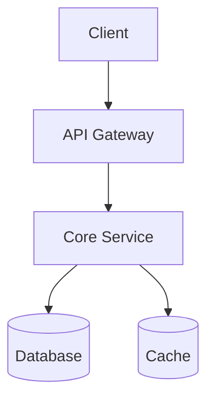
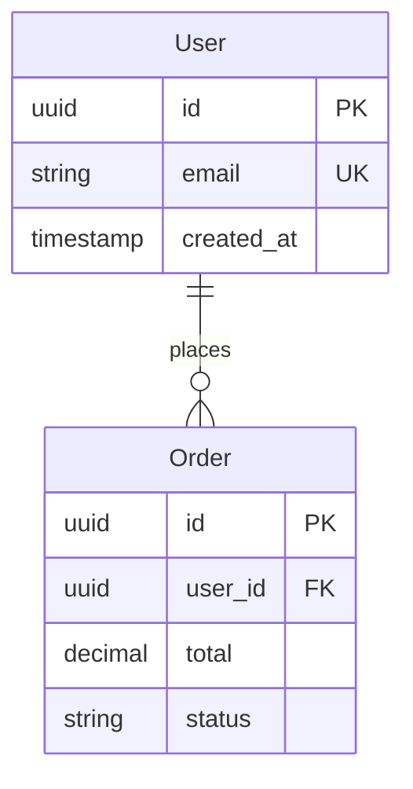
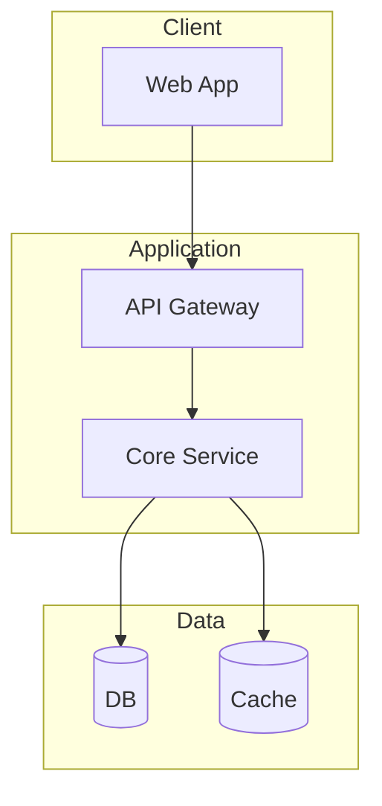
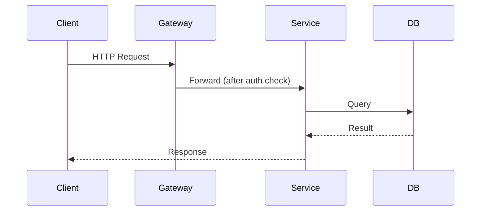
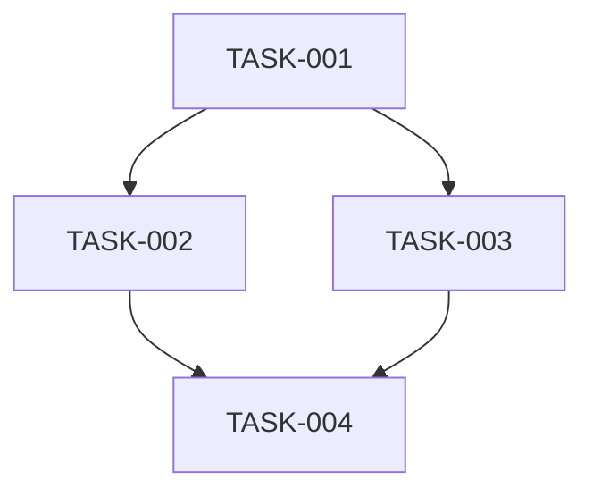

# Spec templates reference

File templates for `.specs/` artifacts created during spec-driven design in the `team-implement` skill.

## Overview

Full mode uses separate files per artifact (proposal, design, review, tasks, decisions). Lite mode combines them into fewer files. Every template below shows 2-3 representative entries (a requirement, an endpoint, a task, an OWASP category, ...), generate the rest of the list following the same shape rather than expecting an exhaustive template for every case. Fill TODO markers with real content; never invent numbers (coverage %, task counts, response times) that no command or agent actually produced.

---

## Input digest template

**Path**: `.specs/<short-id>/input-digest.md`

```markdown
# Input Digest: [Task Title]

**Short ID**: [short-id]
**Created**: YYYY-MM-DD
**Source Type**: [jira-ticket | github-issue | user-request | cli-args]

## Description
[Normalized description of what needs to be built/fixed/improved]

## Acceptance Criteria
- [ ] TODO: success criteria extracted from the source

## Labels/Tags
TODO: e.g. `enhancement`, `bug`, `security`, `high-priority`

## Linked References
TODO: original issue/ticket URL, related PRs, docs
```

---

## Global specs index template

**Path**: `.specs/README.md`

```markdown
# Specs Index

## Active Sessions
| Short ID | Title | Status | Created | Mode |
|----------|-------|--------|---------|------|
| TODO | TODO | in-progress | TODO | full |

## Completed Sessions
| Short ID | Title | Completed | Outcome |
|----------|-------|-----------|---------|
| TODO | TODO | TODO | Merged in PR #123 |

## Session Status Legend
`proposal` → `design` → `review` → `implementation` → `completed` | `abandoned`
```

---

## Session dashboard template

**Path**: `.specs/<short-id>/README.md`

```markdown
# [Task Title]

**Short ID**: [short-id]  **Status**: [proposal|design|review|implementation|completed|abandoned]  **Mode**: [full|lite]

## Session Info
- **Created**: YYYY-MM-DD  **Source**: [link to original issue/ticket]

## Artifacts
- [x] [Input Digest](./input-digest.md)
- [ ] Proposal / Brief
- [ ] Design
- [ ] Review
- [ ] Tasks
- [ ] Decisions (full mode only)

## Progress Summary
- Current phase: [proposal|design|review|implementation]
- Blockers: [None | list]
- Next steps: [what happens next]
```

---

## Full mode templates

### Project brief template

**Path**: `.specs/<short-id>/proposal/brief.md`

```markdown
# Project Brief

## Overview
TODO: 2-3 sentence summary

## Goals / Non-Goals
1. TODO: primary goal
2. TODO: secondary goal

**Non-Goals**: TODO — explicitly out of scope

## Constraints
- **Timeline**: [e.g. must ship by Q2]
- **Technical**: [e.g. must support Python 3.10+]

## Success Metrics
- TODO: measurable outcome (e.g. p95 response time < 200ms)
```

---

### Requirements template

**Path**: `.specs/<short-id>/proposal/requirements.md`

```markdown
# Requirements

## Functional Requirements

**FR-001**: [Title]
- **Description**: [Detail]
- **Priority**: [Must-have | Should-have | Nice-to-have]
- **Dependencies**: [FR-XXX | None]

**FR-002**: [Title]
- **Description**: [Detail]
- **Priority**: [...]
- **Dependencies**: [FR-001]

_(continue FR-003, FR-004... following the same shape)_

## Non-Functional Requirements

**NFR-001**: Performance — [e.g. API p95 < 200ms]
**NFR-002**: Security — [e.g. OAuth 2.0 with PKCE]

_(add NFR-003+ for maintainability, scalability, accessibility as relevant — don't force categories the feature doesn't need)_
```

---

### Acceptance criteria template

**Path**: `.specs/<short-id>/proposal/acceptance-criteria.md`

```markdown
# Acceptance Criteria

## User Stories

### Story 1: [Feature/Scenario Title]
**As a** [user type] **I want** [goal] **so that** [benefit]

**Given** [initial context]
**When** [action occurs]
**Then** [expected outcome]

_(repeat Story 2, 3... — one per FR that has user-visible behavior)_

## Edge Cases

### Edge Case 1: [Scenario]
**Given** [unusual context] **When** [action] **Then** [expected handling, incl. error message text]

_(add edge cases for boundary conditions and failure modes actually relevant to this feature)_

## Definition of Done
- [ ] All FRs implemented and testable
- [ ] Acceptance criteria pass
- [ ] Tests written, coverage target met
- [ ] Code review approved
```

---

### Architecture template

**Path**: `.specs/<short-id>/design/architecture.md`

```markdown
# Architecture

## System Overview
TODO: what pattern (layered, event-driven, ...) and why, aligned with existing codebase patterns

## Component Diagram


## Components

### [Component Name]
- **Responsibility**: [what it does]
- **Technology**: [existing stack it reuses]
- **Dependencies**: [other components]
- **Interfaces**: [REST/gRPC/queue]

_(one entry per major component, don't pad with components that don't exist)_

## Data Flow
1. [Step: request arrives at X]
2. [Step: X validates, forwards to Y]
3. [Step: Y persists, responds]

## Technology Stack
Reuse what the codebase already uses, don't introduce a new framework/library without an ADR (see Decision Record Template below) justifying it.

## Key Design Decisions

### [Decision Title]
- **Choice**: [what] · **Alternatives considered**: [what else, why rejected] · **Tradeoffs**: [what we give up]

## Security & Scalability Notes
TODO: auth/authz approach, encryption, known bottlenecks and mitigations, only what's actually relevant to this feature
```

---

### API contracts template

**Path**: `.specs/<short-id>/design/api-contracts.md`

```markdown
# API Contracts

## Authentication
All endpoints require `Authorization: Bearer {token}` unless noted public.

## Endpoints

### GET /resources
**Query params**: `limit` (default 20, max 100), `offset` (default 0)

Response `200`:
```json
{ "data": [{ "id": "res_123", "name": "...", "created_at": "2026-01-15T10:30:00Z" }],
  "pagination": { "total": 100, "limit": 20, "offset": 0 } }
```
Errors: `401` invalid/missing token, `429` rate limited.

### POST /resources
**Request**:
```json
{ "name": "string (required, 1-255 chars)", "description": "string (optional)" }
```
Response `201` with the created resource. Errors: `400` invalid body, `401`, `422` validation.

_(GET-by-id, PUT, DELETE follow the same request/response/error shape, document them the same way, don't skip the error-response list)_

## Shared Data Models
```typescript
interface ErrorResponse { error: { code: string; message: string; details?: object } }
```

## Rate Limiting
State the actual limit and the `429` response shape, don't invent a number the architect didn't decide.
```

---

### Data model template

**Path**: `.specs/<short-id>/design/data-model.md`

```markdown
# Data Model

## Entity-Relationship Diagram


## Entities

### User (`users` table)
| Field | Type | Constraints | Description |
|-------|------|-------------|-------------|
| `id` | UUID | PRIMARY KEY | |
| `email` | VARCHAR(255) | UNIQUE, NOT NULL | |
| `created_at` | TIMESTAMP | NOT NULL | |

**Indexes**: PRIMARY KEY on `id`, UNIQUE on `email`. **Relationships**: one-to-many with `orders`.

_(one entity block per table, same Field/Indexes/Relationships shape)_

## Migrations
Name migrations sequentially (`NNN_description.sql`), make every one reversible, and note any that aren't zero-downtime safe.

## Performance Notes
Index every foreign key and every field used in a WHERE/ORDER BY the architecture actually requires, don't index speculatively.
```

---

### System overview diagrams template

**Path**: `.specs/<short-id>/design/diagrams/system-overview.md`

```markdown
# System Overview Diagrams

## Architecture Diagram


## Request Flow (Sequence)


_(add a deployment or state-machine diagram only if the feature actually has non-trivial deployment topology or entity state transitions, same Mermaid pattern, don't add empty diagrams for completeness)_
```

---

### Adversary report template

**Path**: `.specs/<short-id>/review/adversary-report.md`

```markdown
# Adversary Report

**Review Date**: YYYY-MM-DD  **Recommendation**: [APPROVE | APPROVE WITH CONDITIONS | REJECT]

## Findings Overview
| ID | Severity | Category | Title |
|----|----------|----------|-------|
| BLOCKER-001 | BLOCKER | Security | [title] |
| WARNING-001 | WARNING | Performance | [title] |

## BLOCKER-001: [Title]
**Location**: [file/component]
**Description**: [the issue] · **Impact**: [what happens if unaddressed] · **Recommendation**: [specific fix]

## WARNING-001: [Title]
Same Description/Impact/Recommendation shape as above, lower severity.

_(SUGGESTION-level findings follow the same shape; list them in the table without full write-ups unless they're non-obvious)_

## Next Steps
1. Address all BLOCKERs before implementation
2. Address or explicitly acknowledge WARNINGs
```

---

### Security assessment template

**Path**: `.specs/<short-id>/review/security-assessment.md`

```markdown
# Security Assessment

**Overall Risk**: [LOW | MEDIUM | HIGH | CRITICAL]

## OWASP Top 10 Assessment

### A01 — Broken Access Control
**Status**: [PASS | FAIL | PARTIAL]
**Findings**: [issue found, or "no issues found"] · **Mitigation**: [how access control is enforced]

### A03 — Injection
**Status**: [PASS | FAIL | PARTIAL]
**Findings**: [e.g. parameterized queries used throughout, or a specific injection point] · **Mitigation**: [approach]

_(walk the remaining categories — A02, A04-A10 — with the same Status/Findings/Mitigation shape; skip a category outright only if it's genuinely not applicable and say why)_

## Remediation Priority
1. **Critical**: [immediate risk item]
2. **High**: [significant risk item]
```

---

### QA plan template

**Path**: `.specs/<short-id>/review/qa-plan.md`

```markdown
# QA Plan

**Coverage target**: [the project's actual bar, or 80% if none is set]

## Acceptance Criteria Validation
| ID | Criterion | Test Case | Status | Evidence |
|----|-----------|-----------|--------|----------|
| AC-001 | [criterion] | [test file/manual steps] | PASS/FAIL | [test output line / screenshot path] |

## Unit Tests
**Location**: `tests/unit/`
```python
def test_email_validation_rejects_malformed_address():
    with pytest.raises(ValidationError):
        User(email="invalid-email", name="Test")
```

## Integration Tests
**Location**: `tests/integration/`
```python
def test_create_order_end_to_end(client, db_session):
    response = client.post("/v1/orders", json={"user_id": user.id, "items": [...]})
    assert response.status_code == 201
```

_(E2E, performance, and security-scan tests follow the same TODO-driven pattern, one representative case each, not a full suite outline; only add a section for a test type the feature actually needs)_

## Test Suite Results
Fill this in from an actual test run, never state a pass/fail count or coverage % that wasn't produced by running the suite.

## Bugs Found
**BUG-001**: [severity], [steps to reproduce], [expected vs actual], [root cause if known]

## Verdict
PASS | FAIL, [what's blocking, if FAIL]
```

---

### Task breakdown template

**Path**: `.specs/<short-id>/tasks/task-breakdown.md`

```markdown
# Task Breakdown

## TASK-001: [Title]
- **Owner**: [role, e.g. backend-engineer]
- **Dependencies**: [None | TASK-XXX]
- **Requirements**: [FR-XXX, NFR-YYY]
- **Acceptance Criteria**: [what "done" means for this task]

## TASK-002: [Title]
- **Owner**: [role]
- **Dependencies**: [TASK-001]
- **Requirements**: [...]
- **Acceptance Criteria**: [...]

_(continue TASK-003+ following the same shape — one per logical unit of work, 1-3 files each; number sequentially)_

## Summary
**Total tasks**: [count] · **Critical path**: TASK-001 → TASK-002 → ...
```

---

### Task graph template

**Path**: `.specs/<short-id>/tasks/task-graph.md`

```markdown
# Task Dependency Graph



## Critical Path
TASK-001 → TASK-002 → TASK-004 (the longest dependency chain)

## Parallelizable Groups
**Group 1** (after TASK-001): TASK-002, TASK-003 can run concurrently.
```

---

### Decision record template

**Path**: `.specs/<short-id>/decisions/NNNN-decision-title.md`

If `cc-arsenal:docs-adr` is installed, use its format instead of this one for consistency across the repo. Minimal fallback:

```markdown
# Decision Record: [Title]

**Status**: [Proposed | Accepted | Rejected | Superseded]

## Context
TODO: the problem and constraints

## Decision
We will [chosen solution].

## Alternatives Considered
**[Alternative]** — Pros: [...] Cons: [...] Rejected because: [...]

## Consequences
**Positive**: [...] **Negative**: [tradeoffs]
```

---

## Lite mode templates

Lite mode collapses the full-mode artifacts above into four files. Same content expectations, less file-splitting ceremony.

### Combined brief template: `.specs/<short-id>/brief.md`
Sections: Overview, Goals/Non-Goals, Requirements (FR-NNN/NFR-NNN, same shape as full mode but inline), Acceptance Criteria (2-3 Given/When/Then stories), Success Metrics.

### Combined design template: `.specs/<short-id>/design.md`
Sections: Architecture (pattern + one Mermaid component diagram), Technology Stack, key API endpoints (2-3, same request/response shape as the full-mode API Contracts Template), key entities (1-2, same Field/Constraints table), Key Design Decisions.

### Combined review template: `.specs/<short-id>/review.md`
Sections: QA Plan summary (test strategy + 3-4 critical test cases as a checklist, no fabricated pass counts), Adversary Findings (BLOCKER-001 / WARNING-001 in the same shape as the full-mode Adversary Report Template), a short Security Assessment (3-4 OWASP categories that actually matter for this feature, PASS/FAIL only).

### Combined tasks template: `.specs/<short-id>/tasks.md`
2-3 representative TASK-NNN entries (same shape as full mode) + a small Mermaid dependency graph + critical path.

---

## Usage guidelines

**Full mode**: complex/multi-subsystem projects, security-critical work, external stakeholders who need detailed specs.
**Lite mode**: small-to-medium features, proof-of-concepts, time-sensitive work.

These are guides, not rigid forms: skip sections that don't apply, add project-specific sections, and prefer clarity over completeness. If lite-mode scope grows mid-session (new stakeholders, new components discovered), it's fine to expand into full-mode artifacts rather than restarting.
